# smppd Design Document

The unified SMPP daemon - gateway, router, load balancer, and proxy in one.

## Overview

**smppd** is a high-performance, configuration-driven SMPP daemon that combines:

- **Gateway** - Accept ESME connections, bridge HTTP↔SMPP
- **Router** - Intelligent message routing with MNP/HLR
- **Load Balancer** - Distribute traffic across SMSC pools
- **Proxy** - Transparent SMPP forwarding

All features emerge from configuration - no mode flags.

### Design Philosophy

1. **Configuration-driven** - Behavior determined by config, not flags
2. **High performance** - 10,000+ msg/sec per node
3. **Zero message loss** - Persistent queuing, guaranteed delivery
4. **Built on smpp-go** - Leverages our SMPP library
5. **Observable** - Prometheus metrics, structured logging
6. **Deployable anywhere** - Binary, Docker, Kubernetes

### Internal Architecture (Envoy-inspired)

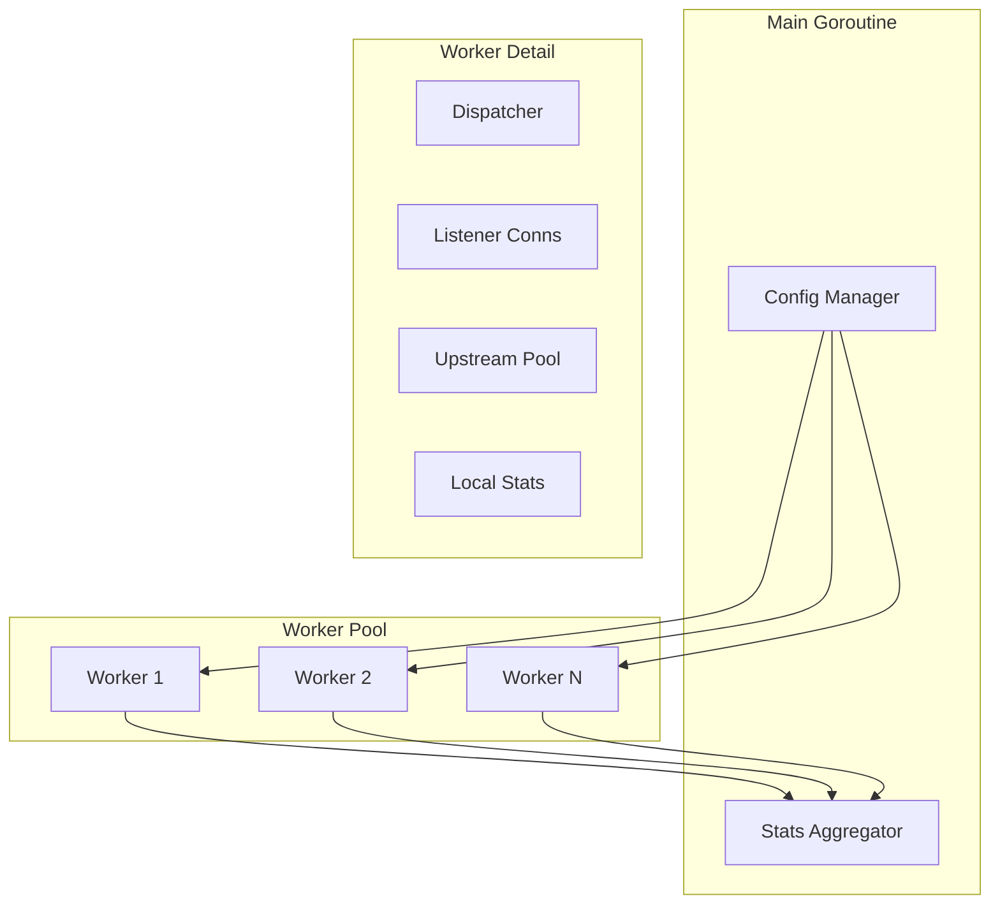
```mermaid
graph TB
    subgraph MainThread[Main Goroutine]
        CFG[Config Manager]
        AGG[Stats Aggregator]
    end

    subgraph Workers[Worker Pool]
        W1[Worker 1]
        W2[Worker 2]
        W3[Worker N]
    end

    subgraph Worker1Detail[Worker Detail]
        DISP[Dispatcher]
        LCONN[Listener Conns]
        UPOOL[Upstream Pool]
        LSTATS[Local Stats]
    end

    CFG --> W1
    CFG --> W2
    CFG --> W3

    W1 --> AGG
    W2 --> AGG
    W3 --> AGG
```

**Core Principles:**

1. **Goroutine-per-connection** - Each connection owns its goroutine
2. **No shared mutable state** - Channel-based communication
3. **Connection affinity** - Request stays on same goroutine
4. **Thread-local pools** - Each worker has own upstream connections
5. **Lock-free hot path** - Atomic counters, no mutexes in message path

**Filter Chain:**

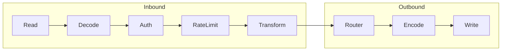
```mermaid
flowchart LR
    subgraph Inbound
        R[Read] --> D[Decode]
        D --> F1[Auth]
        F1 --> F2[RateLimit]
        F2 --> F3[Transform]
    end

    F3 --> Router

    subgraph Outbound
        Router --> E[Encode]
        E --> W[Write]
    end
```

- Filters implement `OnPDU(pdu) FilterStatus`
- Return `Continue`, `Stop`, or `StopIteration`
- Bidirectional: read filters + write filters

**Ownership Model:**

```
DownstreamConn (owns) → Request (borrows) → UpstreamConn
       │                                          │
       └──────── same goroutine ──────────────────┘
```

**Extension Interfaces:**

```go
// Network filter (SMPP codec, TLS, etc)
type NetworkFilter interface {
    OnData(buf []byte) FilterStatus
    OnPDU(pdu PDU) FilterStatus
    OnWrite(pdu PDU) FilterStatus
}

// Load balancer
type LoadBalancer interface {
    Choose(ctx Context) (*Host, error)
    OnSuccess(host *Host, latency time.Duration)
    OnFailure(host *Host, err error)
}

// Health checker
type HealthChecker interface {
    Check(ctx Context, host *Host) error
}

// Retry policy
type RetryPolicy interface {
    ShouldRetry(attempt int, err error) (bool, time.Duration)
}

// Access logger
type AccessLogger interface {
    Log(entry *AccessLogEntry)
}
```

**Hot Restart:**

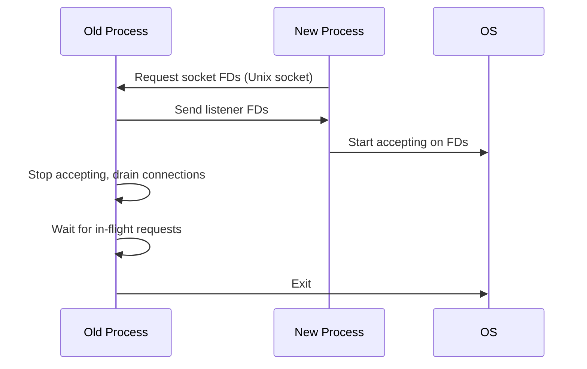
```mermaid
sequenceDiagram
    participant Old as Old Process
    participant New as New Process
    participant OS

    New->>Old: Request socket FDs (Unix socket)
    Old->>New: Send listener FDs
    New->>OS: Start accepting on FDs
    Old->>Old: Stop accepting, drain connections
    Old->>Old: Wait for in-flight requests
    Old->>OS: Exit
```

- New process inherits listener sockets
- Old process drains gracefully
- Zero dropped connections

### Target Performance

| Metric | Target |
|--------|--------|
| Throughput | 10,000+ msg/sec per node |
| Latency | < 10ms p99 |
| Uptime | 99.999% (5 nines) |
| Concurrent Sessions | 10,000+ binds |
| SMSC Connections | 1,000+ per pool |

---

## Architecture

### High-Level Overview

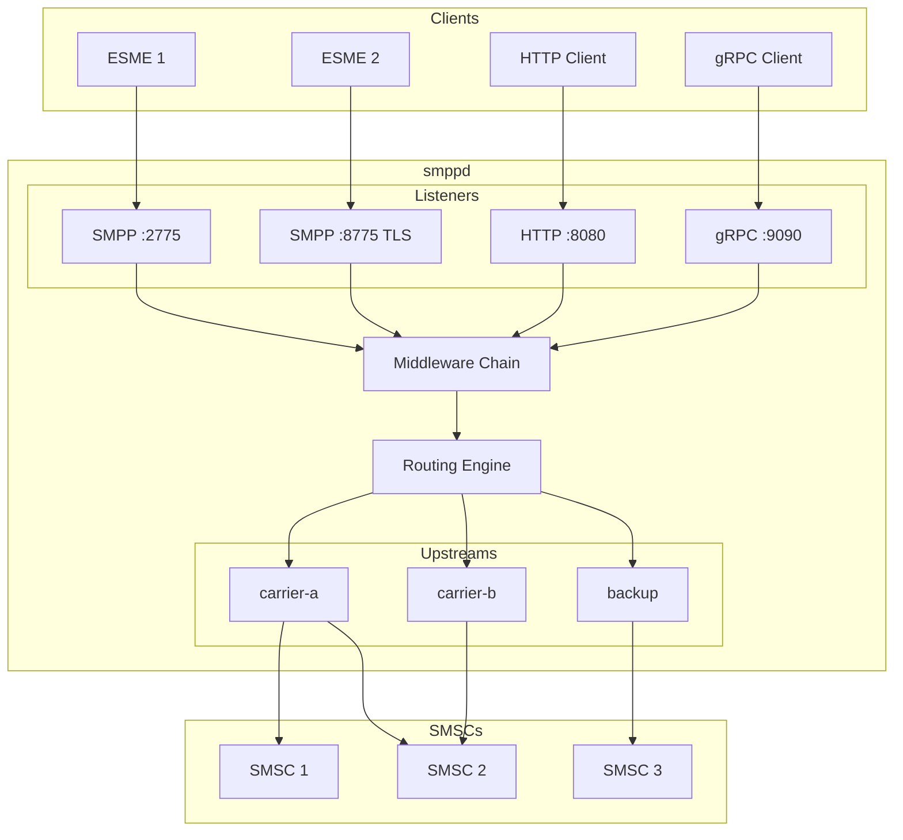
```mermaid
graph TB
    subgraph Clients
        ESME1[ESME 1]
        ESME2[ESME 2]
        HTTP[HTTP Client]
        GRPC[gRPC Client]
    end

    subgraph smppd[smppd]
        subgraph Listeners
            L1[SMPP :2775]
            L2[SMPP :8775 TLS]
            L3[HTTP :8080]
            L4[gRPC :9090]
        end

        MW[Middleware Chain]
        RT[Routing Engine]

        subgraph Upstreams
            UP1[carrier-a]
            UP2[carrier-b]
            UP3[backup]
        end
    end

    subgraph SMSCs
        SMSC1[SMSC 1]
        SMSC2[SMSC 2]
        SMSC3[SMSC 3]
    end

    ESME1 --> L1
    ESME2 --> L2
    HTTP --> L3
    GRPC --> L4

    L1 --> MW
    L2 --> MW
    L3 --> MW
    L4 --> MW

    MW --> RT

    RT --> UP1
    RT --> UP2
    RT --> UP3

    UP1 --> SMSC1
    UP1 --> SMSC2
    UP2 --> SMSC2
    UP3 --> SMSC3
```

### Message Flow

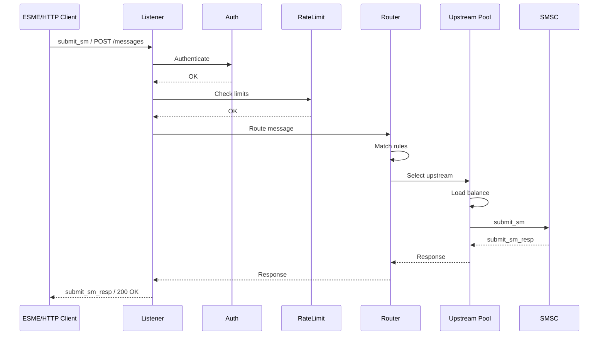
```mermaid
sequenceDiagram
    participant Client as ESME/HTTP Client
    participant Listener
    participant Auth
    participant RateLimit
    participant Router
    participant Pool as Upstream Pool
    participant SMSC

    Client->>Listener: submit_sm / POST /messages
    Listener->>Auth: Authenticate
    Auth-->>Listener: OK
    Listener->>RateLimit: Check limits
    RateLimit-->>Listener: OK
    Listener->>Router: Route message
    Router->>Router: Match rules
    Router->>Pool: Select upstream
    Pool->>Pool: Load balance
    Pool->>SMSC: submit_sm
    SMSC-->>Pool: submit_sm_resp
    Pool-->>Router: Response
    Router-->>Listener: Response
    Listener-->>Client: submit_sm_resp / 200 OK
```

### Component Architecture

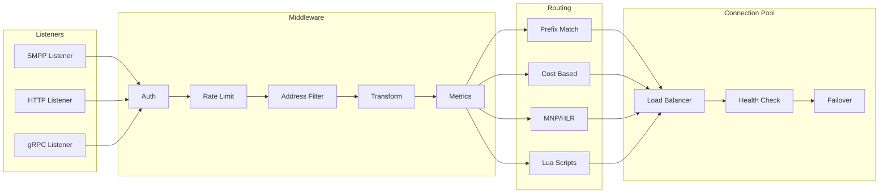
```mermaid
graph LR
    subgraph Listeners
        SMPP[SMPP Listener]
        HTTP[HTTP Listener]
        GRPC[gRPC Listener]
    end

    subgraph Middleware
        AUTH[Auth]
        RL[Rate Limit]
        AF[Address Filter]
        TR[Transform]
        MET[Metrics]
    end

    subgraph Routing
        PM[Prefix Match]
        CB[Cost Based]
        MNP[MNP/HLR]
        LUA[Lua Scripts]
    end

    subgraph Pool[Connection Pool]
        LB[Load Balancer]
        HC[Health Check]
        FO[Failover]
    end

    SMPP --> AUTH
    HTTP --> AUTH
    GRPC --> AUTH

    AUTH --> RL --> AF --> TR --> MET

    MET --> PM
    MET --> CB
    MET --> MNP
    MET --> LUA

    PM --> LB
    CB --> LB
    MNP --> LB
    LUA --> LB

    LB --> HC
    HC --> FO
```

### Upstream Connection Pool

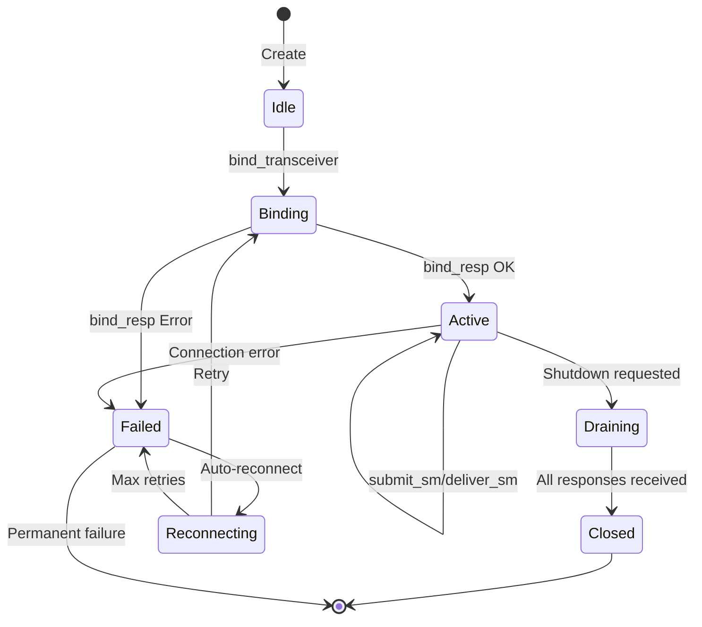
```mermaid
stateDiagram-v2
    [*] --> Idle: Create
    Idle --> Binding: bind_transceiver
    Binding --> Active: bind_resp OK
    Binding --> Failed: bind_resp Error
    Active --> Active: submit_sm/deliver_sm
    Active --> Draining: Shutdown requested
    Active --> Failed: Connection error
    Draining --> Closed: All responses received
    Failed --> Reconnecting: Auto-reconnect
    Reconnecting --> Binding: Retry
    Reconnecting --> Failed: Max retries
    Closed --> [*]
    Failed --> [*]: Permanent failure
```

### Failover Flow

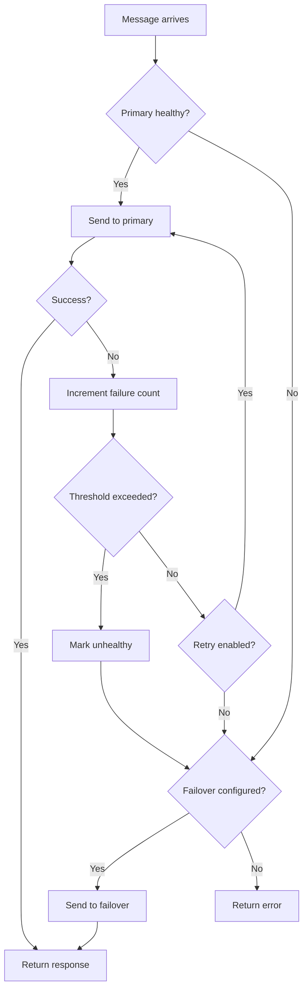
```mermaid
flowchart TD
    A[Message arrives] --> B{Primary healthy?}
    B -->|Yes| C[Send to primary]
    B -->|No| D{Failover configured?}
    C --> E{Success?}
    E -->|Yes| F[Return response]
    E -->|No| G[Increment failure count]
    G --> H{Threshold exceeded?}
    H -->|Yes| I[Mark unhealthy]
    H -->|No| J{Retry enabled?}
    I --> D
    J -->|Yes| C
    J -->|No| D
    D -->|Yes| K[Send to failover]
    D -->|No| L[Return error]
    K --> F
```

### Routing Decision Tree

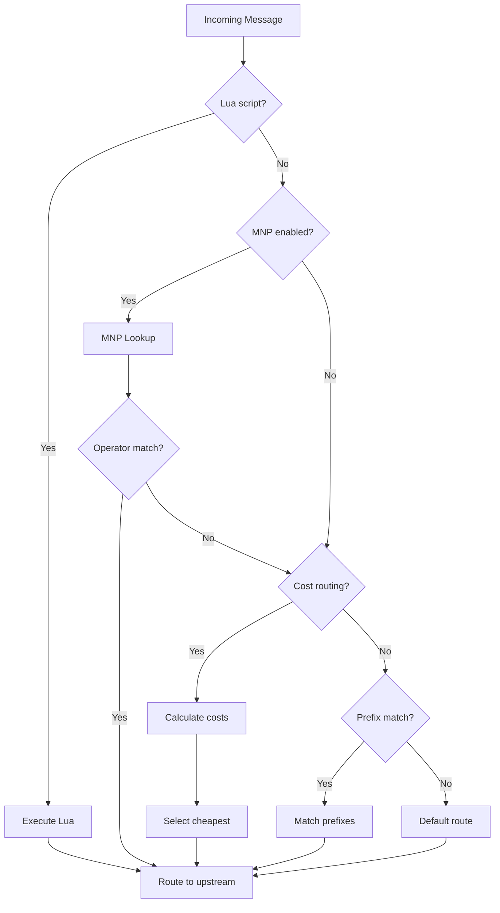
```mermaid
flowchart TD
    A[Incoming Message] --> B{Lua script?}
    B -->|Yes| C[Execute Lua]
    C --> Z[Route to upstream]
    B -->|No| D{MNP enabled?}
    D -->|Yes| E[MNP Lookup]
    E --> F{Operator match?}
    F -->|Yes| Z
    F -->|No| G{Cost routing?}
    D -->|No| G
    G -->|Yes| H[Calculate costs]
    H --> I[Select cheapest]
    I --> Z
    G -->|No| J{Prefix match?}
    J -->|Yes| K[Match prefixes]
    K --> Z
    J -->|No| L[Default route]
    L --> Z
```

### Cluster Synchronization

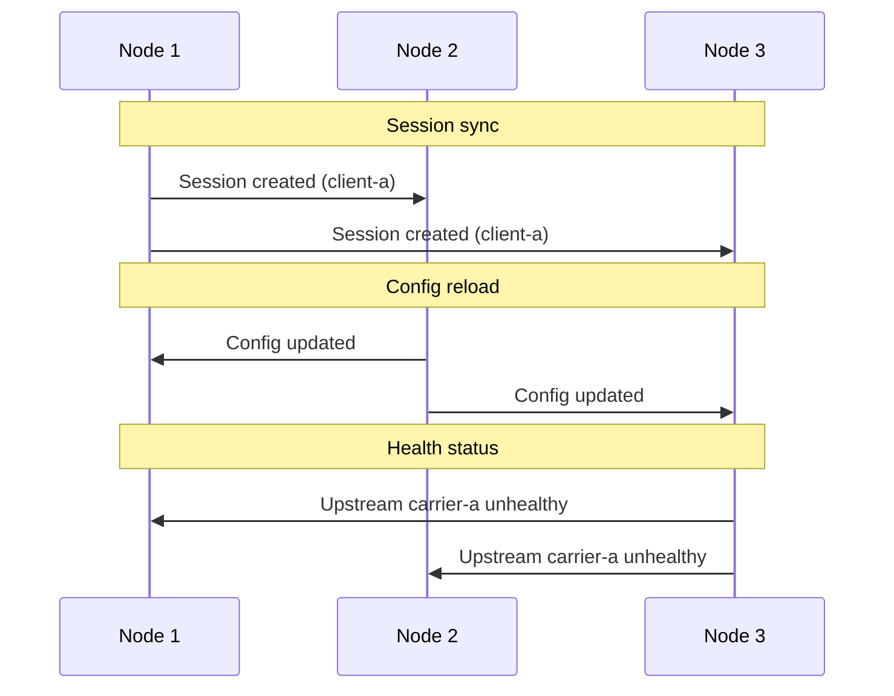
```mermaid
sequenceDiagram
    participant N1 as Node 1
    participant N2 as Node 2
    participant N3 as Node 3

    Note over N1,N3: Session sync
    N1->>N2: Session created (client-a)
    N1->>N3: Session created (client-a)

    Note over N1,N3: Config reload
    N2->>N1: Config updated
    N2->>N3: Config updated

    Note over N1,N3: Health status
    N3->>N1: Upstream carrier-a unhealthy
    N3->>N2: Upstream carrier-a unhealthy
```

---

## Configuration

All features are enabled through configuration:

```yaml
# /etc/smppd/smppd.yaml

# Listeners - what protocols to accept
listeners:
  - name: smpp
    type: smpp
    address: :2775

  - name: smpp-tls
    type: smpp
    address: :8775
    tls:
      cert: /etc/smppd/certs/server.crt
      key: /etc/smppd/certs/server.key

  - name: http
    type: http
    address: :8080

  - name: grpc
    type: grpc
    address: :9090

# Upstreams - SMSC connection pools
upstreams:
  - name: carrier-a
    hosts:
      # Hosts can share upstream-level bind credentials
      - address: smsc1.carrier-a.com:2775
        weight: 100
      - address: smsc2.carrier-a.com:2775
        weight: 100
    bind:
      system_id: carrier_a_user
      password: carrier_a_pass
      type: transceiver
    pool:
      min_connections: 5
      max_connections: 50

  - name: carrier-b
    hosts:
      # Or each host can have its own credentials
      - address: smsc1.carrier-b.com:2775
        bind:
          system_id: carrier_b_smsc1_user
          password: carrier_b_smsc1_pass
      - address: smsc2.carrier-b.com:2775
        bind:
          system_id: carrier_b_smsc2_user
          password: carrier_b_smsc2_pass
    bind:
      type: transceiver  # Shared settings, credentials per-host

  - name: backup
    hosts:
      - address: backup.smsc.com:2775
    bind:
      system_id: backup_user
      password: backup_pass
      type: transceiver

# Routes - how to route messages
routes:
  - name: mozambique
    match:
      destination_addr: "+258*"
    upstream: carrier-a

  - name: south-africa
    match:
      destination_addr: "+27*"
    upstream: carrier-b

  - name: default
    match:
      destination_addr: "*"
    upstream: carrier-a
    failover: backup

# Clients - ESME authentication
clients:
  - system_id: client-a
    password: client_a_pass
    allowed_ips: ["192.168.1.0/24"]
    rate_limit:
      messages_per_second: 1000

  - system_id: client-b
    password: client_b_pass
    rate_limit:
      messages_per_second: 500
```

---

## Listeners

Each listener is independent with its own TLS, timeouts, limits, and settings.

### Multiple Listeners Example

```yaml
listeners:
  # Plain SMPP - internal network
  - name: smpp-internal
    type: smpp
    address: 10.0.0.1:2775
    max_connections: 1000

  # TLS SMPP - external clients, strict mTLS
  - name: smpp-external
    type: smpp
    address: 0.0.0.0:8775
    tls:
      cert: /etc/smppd/certs/external.crt
      key: /etc/smppd/certs/external.key
      ca: /etc/smppd/certs/client-ca.crt
      client_auth: require
    max_connections: 5000

  # HTTP API - internal
  - name: http-internal
    type: http
    address: 10.0.0.1:8080
    timeouts:
      read: 30s
      write: 30s

  # HTTPS API - external with different cert
  - name: https-external
    type: http
    address: 0.0.0.0:8443
    tls:
      cert: /etc/smppd/certs/api.crt
      key: /etc/smppd/certs/api.key
    timeouts:
      read: 60s
      write: 60s

  # gRPC - internal only
  - name: grpc
    type: grpc
    address: 127.0.0.1:9090
```

### Listener Configuration (Full Reference)

```yaml
listeners:
  - name: smpp-main
    type: smpp
    address: :2775

    # TLS/mTLS
    tls:
      enabled: true
      cert: /etc/smppd/certs/server.crt
      key: /etc/smppd/certs/server.key
      ca: /etc/smppd/certs/ca.crt
      client_auth: require       # none, request, require
      min_version: "1.2"
      max_version: "1.3"
      cipher_suites:
        - TLS_ECDHE_RSA_WITH_AES_256_GCM_SHA384
        - TLS_ECDHE_RSA_WITH_AES_128_GCM_SHA256

    # Connection limits
    max_connections: 10000
    max_connections_per_ip: 100
    max_connections_per_client: 50

    # Timeouts
    timeouts:
      read: 60s
      write: 30s
      idle: 5m
      bind: 30s
      response: 30s

    # SMPP protocol settings
    smpp:
      versions: [3.3, 3.4, 5.0]
      auto_negotiate: true
      enquire_link_interval: 30s
      enquire_link_timeout: 10s
      window_size: 100

    # Rate limiting (per listener)
    rate_limit:
      connections_per_second: 100
      binds_per_second: 50

    # IP filtering
    allowed_ips:
      - 192.168.0.0/16
      - 10.0.0.0/8
    blocked_ips:
      - 10.0.0.99

  - name: http-api
    type: http
    address: :8080

    # TLS
    tls:
      enabled: true
      cert: /etc/smppd/certs/api.crt
      key: /etc/smppd/certs/api.key

    # HTTP settings
    http:
      read_timeout: 30s
      write_timeout: 30s
      idle_timeout: 120s
      max_header_bytes: 1048576
      max_body_bytes: 10485760

    # Rate limiting
    rate_limit:
      requests_per_second: 1000
      burst: 2000

    # CORS
    cors:
      enabled: true
      allowed_origins: ["https://app.example.com"]
      allowed_methods: ["GET", "POST"]
      allowed_headers: ["Authorization", "Content-Type"]

  - name: grpc
    type: grpc
    address: :9090

    tls:
      cert: /etc/smppd/certs/grpc.crt
      key: /etc/smppd/certs/grpc.key

    grpc:
      max_recv_msg_size: 4194304
      max_send_msg_size: 4194304
      keepalive:
        time: 30s
        timeout: 10s
```

#### HTTP API Endpoints

```
POST /v1/messages          - Send message
GET  /v1/messages/{id}     - Get message status
POST /v1/messages/batch    - Send batch
GET  /v1/health            - Health check
GET  /v1/metrics           - Prometheus metrics
```

```json
// POST /v1/messages
{
  "to": "+258841234567",
  "from": "MYAPP",
  "text": "Hello World",
  "registered_delivery": true
}

// Response
{
  "message_id": "msg_abc123",
  "status": "accepted",
  "parts": 1
}
```

### gRPC Listener

For programmatic access:

```yaml
listeners:
  - name: grpc
    type: grpc
    address: :9090
    tls:
      cert: /etc/smppd/certs/server.crt
      key: /etc/smppd/certs/server.key
```

---

## Upstreams

Each upstream is independent with its own credentials, TLS, and settings:

```yaml
upstreams:
  # Carrier A - direct connection, TLS, mTLS client cert
  - name: carrier-a
    hosts:
      - address: smsc1.carrier-a.com:8775
        weight: 100
      - address: smsc2.carrier-a.com:8775
        weight: 100

    bind:
      system_id: carrier_a_user
      password: carrier_a_pass
      system_type: "OTP"
      type: transceiver

    tls:
      enabled: true
      cert: /etc/smppd/certs/carrier-a-client.crt   # mTLS client cert
      key: /etc/smppd/certs/carrier-a-client.key
      ca: /etc/smppd/certs/carrier-a-ca.crt

    pool:
      min_connections: 10
      max_connections: 100

  # Carrier B - plain SMPP, different credentials
  - name: carrier-b
    hosts:
      - address: smsc.carrier-b.com:2775

    bind:
      system_id: carrier_b_user
      password: carrier_b_pass
      system_type: ""
      type: transmitter

    # No TLS
    tls:
      enabled: false

    pool:
      min_connections: 5
      max_connections: 20

  # Aggregator - TLS but no client cert
  - name: aggregator
    hosts:
      - address: smsc.aggregator.com:8775

    bind:
      system_id: aggregator_user
      password: aggregator_pass
      type: transceiver

    tls:
      enabled: true
      skip_verify: false
      # No client cert - server TLS only

  # Backup - different region, different creds
  - name: backup
    hosts:
      - address: backup-eu.smsc.com:2775
      - address: backup-us.smsc.com:2775

    bind:
      system_id: backup_user
      password: backup_pass
      type: transceiver
```

### Upstream Configuration (Full Reference)

Each upstream has its own independent configuration:

```yaml
upstreams:
  - name: carrier-a

    # Hosts - multiple for load balancing/failover
    hosts:
      - address: smsc1.carrier-a.com:2775
        weight: 100
        priority: 1
      - address: smsc2.carrier-a.com:2775
        weight: 100
        priority: 1
      - address: smsc3.carrier-a.com:2775
        weight: 50
        priority: 2  # Lower priority = backup
        # Per-host credentials override upstream-level bind
        bind:
          system_id: carrier_a_smsc3_user
          password: carrier_a_smsc3_pass

    # Bind credentials (default for all hosts)
    bind:
      system_id: carrier_a_user
      password: carrier_a_pass
      system_type: "OTP"
      type: transceiver          # transmitter, receiver, transceiver
      version: 3.4               # SMPP version
      interface_version: 0x34
      addr_ton: 0
      addr_npi: 0
      address_range: ""

    # TLS/mTLS
    tls:
      enabled: true
      cert: /etc/smppd/certs/carrier-a-client.crt
      key: /etc/smppd/certs/carrier-a-client.key
      ca: /etc/smppd/certs/carrier-a-ca.crt
      skip_verify: false
      server_name: smsc.carrier-a.com    # SNI
      min_version: "1.2"
      max_version: "1.3"
      cipher_suites:
        - TLS_ECDHE_RSA_WITH_AES_256_GCM_SHA384

    # Connection pool
    pool:
      min_connections: 5
      max_connections: 50
      idle_timeout: 5m
      max_lifetime: 1h

    # Timeouts
    timeouts:
      connect: 10s
      bind: 30s
      submit: 30s
      response: 30s
      enquire_link: 60s
      read: 60s
      write: 30s

    # Health checks
    health:
      enabled: true
      type: enquire_link       # tcp, enquire_link, submit
      interval: 30s
      timeout: 10s
      threshold: 3             # Failures before unhealthy
      recovery_threshold: 2    # Successes before healthy

    # Load balancing
    load_balancing:
      algorithm: weighted_round_robin
      # round_robin, least_connections, weighted_round_robin,
      # random, ip_hash, latency

    # Retry
    retry:
      enabled: true
      max_attempts: 3
      delay: 1s
      max_delay: 30s
      backoff: exponential     # fixed, exponential, linear
      backoff_factor: 2
      retryable_errors:
        - 0x00000008           # System error
        - 0x00000058           # Throttled

    # Rate limiting (to protect upstream)
    rate_limit:
      messages_per_second: 500
      burst: 1000

    # Window (max in-flight)
    window:
      size: 100
      timeout: 60s

    # Enquire link
    enquire_link:
      interval: 30s
      timeout: 10s

    # Protocol options
    protocol:
      version: 3.4
      auto_respond_enquire: true
      auto_respond_unbind: true

    # Message options
    message:
      max_length: 160
      default_encoding: gsm7
      default_registered_delivery: 0
      default_service_type: ""
      default_source_addr_ton: 5
      default_source_addr_npi: 0

    # Failover
    failover:
      enabled: true
      threshold: 3             # Consecutive failures
      recovery_time: 60s
      fallback: backup         # Upstream to failover to

    # Maintenance scheduling
    maintenance:
      # Scheduled maintenance windows
      windows:
        - name: weekly-maintenance
          schedule: "0 2 * * SUN"    # Cron: 2am every Sunday
          duration: 2h
          action: suspend            # suspend, drain, reduce_weight

        - name: monthly-update
          schedule: "0 3 1 * *"      # 3am first of month
          duration: 4h
          action: drain

      # Automatic suspension on degradation
      auto_suspend:
        enabled: true
        error_rate: 0.10             # 10% error rate
        latency_p99: 1s              # p99 > 1s
        duration: 5m                 # Suspend for 5 min

    # Circuit breaker (Envoy-style)
    circuit_breaker:
      max_connections: 100           # Max concurrent connections
      max_pending_requests: 1000     # Max queued requests
      max_requests: 10000            # Max active requests
      max_retries: 3                 # Max concurrent retries

    # Outlier detection (auto-eject unhealthy hosts)
    outlier_detection:
      consecutive_errors: 5          # Errors before ejection
      interval: 10s                  # Analysis interval
      base_ejection_time: 30s        # Min ejection duration
      max_ejection_percent: 50       # Max % of hosts ejected
      success_rate_minimum_hosts: 3  # Min hosts for stats
      success_rate_threshold: 85     # Eject if below this %

    # Tags/metadata
    tags:
      region: eu
      tier: premium
      cost_per_sms: 0.01

---

## Routing

### Route Matching

```yaml
routes:
  # Match by destination prefix
  - name: mozambique-vodacom
    match:
      destination_addr: "+25884*"
    upstream: vodacom-mz

  # Match by destination prefix (country)
  - name: mozambique
    match:
      destination_addr: "+258*"
    upstream: carrier-a

  # Match by source address
  - name: premium-sender
    match:
      source_addr: "PREMIUM"
    upstream: premium-carrier

  # Match by service type
  - name: marketing
    match:
      service_type: "MKTG"
    upstream: marketing-carrier

  # Match by client
  - name: vip-client
    match:
      client: "vip-client-a"
    upstream: premium-carrier

  # Match by time
  - name: night-rates
    match:
      destination_addr: "*"
      schedule:
        timezone: "Africa/Maputo"
        hours: "22:00-06:00"
    upstream: budget-carrier

  # Multiple conditions (AND)
  - name: complex-route
    match:
      destination_addr: "+258*"
      source_addr_ton: 5  # Alphanumeric
      client: "client-a"
    upstream: carrier-a

  # Default route (catch-all)
  - name: default
    match:
      destination_addr: "*"
    upstream: carrier-a
    failover: backup
```

### Cost-Based Routing

```yaml
routes:
  - name: cost-optimized
    match:
      destination_addr: "*"
    upstream: cost-pool

upstreams:
  - name: cost-pool
    load_balancing:
      algorithm: cost_based
    hosts:
      - address: smsc1.carrier-a.com:2775
        cost:
          "+258": 0.010
          "+27": 0.015
          "*": 0.025
      - address: smsc.carrier-b.com:2775
        cost:
          "+258": 0.012
          "+27": 0.010
          "*": 0.020
```

### MNP/HLR Routing

```yaml
mnp:
  enabled: true
  provider: xconnect  # xconnect, hlr_lookup, custom

  xconnect:
    url: https://api.xconnect.io/npq
    api_key: xconnect_api_key

  cache:
    enabled: true
    ttl: 24h
    max_size: 10000000

routes:
  # Route by operator (from MNP lookup)
  - name: vodacom-direct
    match:
      mnc: "01"  # Requires MNP lookup
    upstream: vodacom-direct

  # Route ported numbers differently
  - name: ported-numbers
    match:
      is_ported: true
    upstream: mnp-aware-carrier
```

### Lua Scripting

```yaml
routes:
  - name: custom-logic
    match:
      destination_addr: "*"
    script: /etc/smppd/routing.lua
```

```lua
-- /etc/smppd/routing.lua
function route(msg, ctx)
    local dest = msg.destination_addr
    local client = ctx.client_id

    -- Premium clients get direct routes
    if ctx.client_tier == "premium" then
        if dest:match("^%+258") then
            return "mz-direct"
        end
    end

    -- Time-based routing
    local hour = os.date("*t").hour
    if hour >= 22 or hour < 6 then
        return "night-rates"
    end

    -- Default
    return "default"
end
```

---

## Credit Control

Prepaid balance and usage quotas per client:

```yaml
credit_control:
  enabled: true
  backend: sqlite  # sqlite, redis, postgres

  sqlite:
    path: /var/lib/smppd/credits.db

  # Or external
  redis:
    address: redis:6379
    key_prefix: smppd:credits:
```

### Client Credits

```yaml
clients:
  - system_id: client-a
    password: client_a_pass

    # Credit configuration
    credits:
      balance: 10000           # Current balance (messages or currency)
      currency: messages       # messages, usd, eur
      low_balance_threshold: 1000
      on_exhausted: reject     # reject, queue, notify

    # Usage quotas
    quotas:
      daily: 50000             # Max messages per day
      monthly: 1000000         # Max messages per month
      reset_time: "00:00"      # Daily reset time
      timezone: "UTC"
```

### Credit Operations

```yaml
# Deduct on submit_sm_resp success
deduct:
  on: submit_sm_resp
  amount: 1                    # Per message
  multipart: per_part          # per_part, per_message

# Cost-based deduction
deduct:
  on: submit_sm_resp
  amount: cost                 # Use route cost
  markup: 1.2                  # 20% markup
```

### Credit API

```
POST /api/credits/{client}/topup     - Add credits
POST /api/credits/{client}/deduct    - Deduct credits
GET  /api/credits/{client}           - Get balance
GET  /api/credits/{client}/usage     - Usage history
```

### Credit gRPC

```protobuf
service CreditService {
  rpc GetBalance(GetBalanceRequest) returns (Balance);
  rpc TopUp(TopUpRequest) returns (Balance);
  rpc Deduct(DeductRequest) returns (Balance);
  rpc GetUsage(GetUsageRequest) returns (UsageReport);
  rpc StreamBalance(StreamBalanceRequest) returns (stream Balance);
}

message Balance {
  string client = 1;
  int64 balance = 2;
  string currency = 3;
  int64 daily_used = 4;
  int64 daily_quota = 5;
  int64 monthly_used = 6;
  int64 monthly_quota = 7;
}
```

### Credit Flow

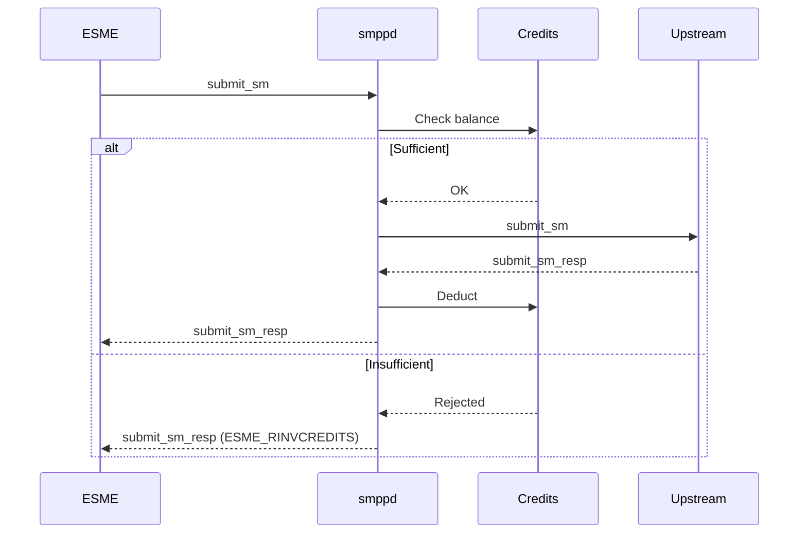
```mermaid
sequenceDiagram
    participant ESME
    participant smppd
    participant Credits
    participant Upstream

    ESME->>smppd: submit_sm
    smppd->>Credits: Check balance
    alt Sufficient
        Credits-->>smppd: OK
        smppd->>Upstream: submit_sm
        Upstream-->>smppd: submit_sm_resp
        smppd->>Credits: Deduct
        smppd-->>ESME: submit_sm_resp
    else Insufficient
        Credits-->>smppd: Rejected
        smppd-->>ESME: submit_sm_resp (ESME_RINVCREDITS)
    end
```

---

## Built-in Simulator

SMSC simulator mode for testing:

```yaml
simulator:
  enabled: true

  # Simulated SMSC behavior
  behavior:
    # Response delay
    latency:
      min: 10ms
      max: 100ms
      distribution: normal    # normal, uniform, fixed

    # Delivery receipt delay
    dlr_delay:
      min: 1s
      max: 30s

    # Error rates
    errors:
      submit_fail_rate: 0.01        # 1% submit failures
      delivery_fail_rate: 0.05      # 5% delivery failures
      throttle_rate: 0.001          # 0.1% throttling

    # Error codes to return
    error_codes:
      - code: 0x00000008            # System error
        weight: 50
      - code: 0x00000058            # Throttled
        weight: 30
      - code: 0x00000014            # Invalid dest
        weight: 20

  # Message ID generation
  message_id:
    format: uuid                    # uuid, sequential, random
    prefix: "SIM"

  # DLR generation
  dlr:
    enabled: true
    states:
      - state: DELIVRD
        weight: 90
      - state: UNDELIV
        weight: 5
      - state: EXPIRED
        weight: 5

  # MO generation (for testing)
  mo:
    enabled: false
    rate: 10                        # Messages per second
    source: "+258841234567"
    destination: "12345"
    text: "Test MO message"
```

### Simulator Endpoints

```
POST /api/simulator/mo              - Inject MO message
POST /api/simulator/dlr             - Inject DLR
POST /api/simulator/error           - Trigger error
GET  /api/simulator/stats           - Simulator stats
POST /api/simulator/reset           - Reset counters
```

### Simulator as Upstream

```yaml
# Use simulator as an upstream for testing
upstreams:
  - name: test-smsc
    type: simulator               # Built-in simulator
    behavior:
      latency: { min: 50ms, max: 200ms }
      submit_fail_rate: 0.02

routes:
  - name: test-route
    match:
      destination_addr: "+999*"   # Test prefix
    upstream: test-smsc
```

### Simulator gRPC

```protobuf
service SimulatorService {
  // Inject messages
  rpc InjectMO(InjectMORequest) returns (InjectMOResponse);
  rpc InjectDLR(InjectDLRRequest) returns (InjectDLRResponse);

  // Control
  rpc SetBehavior(SetBehaviorRequest) returns (SetBehaviorResponse);
  rpc GetStats(GetStatsRequest) returns (SimulatorStats);
  rpc Reset(ResetRequest) returns (ResetResponse);
}

message SimulatorStats {
  uint64 messages_received = 1;
  uint64 messages_accepted = 2;
  uint64 messages_rejected = 3;
  uint64 dlrs_sent = 4;
  uint64 mos_sent = 5;
  map<uint32, uint64> error_counts = 6;
}
```

---

## Clients

ESME authentication and authorization:

```yaml
clients:
  - system_id: client-a
    password: client_a_pass

    # IP restrictions
    allowed_ips:
      - 192.168.1.0/24
      - 10.0.0.0/8

    # Bind restrictions
    bind_types: [transmitter, transceiver]
    max_connections: 10

    # Rate limiting
    rate_limit:
      messages_per_second: 1000
      window_size: 5000  # Max in-flight

    # Address restrictions
    addresses:
      source:
        allowed: ["MYAPP", "CLIENT-A"]
      destination:
        blocked: ["+1900*", "+1976*"]  # Block premium

    # Force specific upstream
    upstream: premium-carrier

    # Metadata
    tier: premium
    tags:
      billing_id: "12345"

  - system_id: client-b
    password: client_b_pass
    rate_limit:
      messages_per_second: 100
    tier: standard
```

### External Authentication

```yaml
auth:
  # LDAP
  ldap:
    enabled: true
    url: ldap://ldap.example.com:389
    bind_dn: cn=admin,dc=example,dc=com
    bind_password: ldap_bind_password
    base_dn: ou=smpp,dc=example,dc=com

  # RADIUS
  radius:
    enabled: false
    server: radius.example.com:1812
    secret: radius_secret

  # DIAMETER (3GPP)
  diameter:
    enabled: false
    host: diameter.example.com
    port: 3868
    origin_host: smppd.example.com
    origin_realm: example.com
    application_id: 4           # Diameter Credit-Control
    vendor_id: 10415            # 3GPP
    timeout: 5s

  # HTTP (REST API)
  http:
    enabled: false
    url: https://auth.example.com/smpp/verify
    timeout: 5s
    cache_ttl: 5m

  # Passthrough (trust upstream)
  passthrough:
    enabled: false
    upstreams: [carrier-a]      # Trust these upstreams
```

---

## Middleware

### Processing Pipeline


```mermaid
flowchart LR
    IN[Incoming PDU] --> A[Logger]
    A --> B[Auth]
    B --> C[Rate Limit]
    C --> D[Address Filter]
    D --> E[Transform]
    E --> F[Protocol]
    F --> G[Metrics]
    G --> OUT[Routing Engine]
```

Processing pipeline:

```yaml
middleware:
  # Logging
  - type: logger
    level: info

  # Authentication (always enabled if clients defined)
  - type: auth

  # Rate limiting
  - type: rate_limit

  # Address filtering
  - type: address_filter

  # Message transformation
  - type: transform
    rules:
      # Rewrite sender
      - match:
          client: "client-a"
        set:
          source_addr: "CLIENT-A"
          source_addr_ton: 5

      # Add country code
      - match:
          destination_addr: "^8[0-9]{8}$"
        transform:
          destination_addr: "+258${destination_addr}"

      # Append opt-out
      - match:
          service_type: "MKTG"
        transform:
          short_message: "${short_message} Reply STOP to opt out."

  # Protocol translation
  - type: protocol
    version_mapping:
      "3.3": "3.4"  # Translate 3.3 clients to 3.4 for SMSC

  # Metrics
  - type: metrics
    prometheus: true
```

---

## DLR Error Code Harmonization

Normalize delivery receipt error codes across carriers:

```yaml
dlr:
  harmonization:
    enabled: true

    # Map carrier-specific codes to standard codes
    mappings:
      # Carrier A uses custom codes
      carrier-a:
        "001": { state: DELIVRD, error: 0 }
        "002": { state: UNDELIV, error: 1 }
        "003": { state: EXPIRED, error: 2 }
        "ERR_NET": { state: UNDELIV, error: 6 }

      # Carrier B uses different format
      carrier-b:
        "DELIVERED": { state: DELIVRD, error: 0 }
        "FAILED": { state: UNDELIV, error: 1 }
        "TIMEOUT": { state: EXPIRED, error: 2 }

    # Standard error codes (output)
    standard_codes:
      0: "No error"
      1: "Unknown subscriber"
      2: "Expired"
      3: "Rejected"
      4: "Blacklisted"
      5: "Unroutable"
      6: "Network error"
      7: "Invalid destination"
      8: "Spam filter"

    # DLR format normalization
    format:
      # Parse various DLR text formats
      patterns:
        - regex: "id:([^ ]+) sub:([^ ]+) dlvrd:([^ ]+) submit date:([^ ]+) done date:([^ ]+) stat:([^ ]+) err:([^ ]+)"
        - regex: "id=([^&]+)&stat=([^&]+)&err=([^&]+)"

      # Output format
      output: "id:{id} sub:001 dlvrd:001 submit date:{submit_date} done date:{done_date} stat:{stat} err:{err} text:"
```

### DLR State Mapping

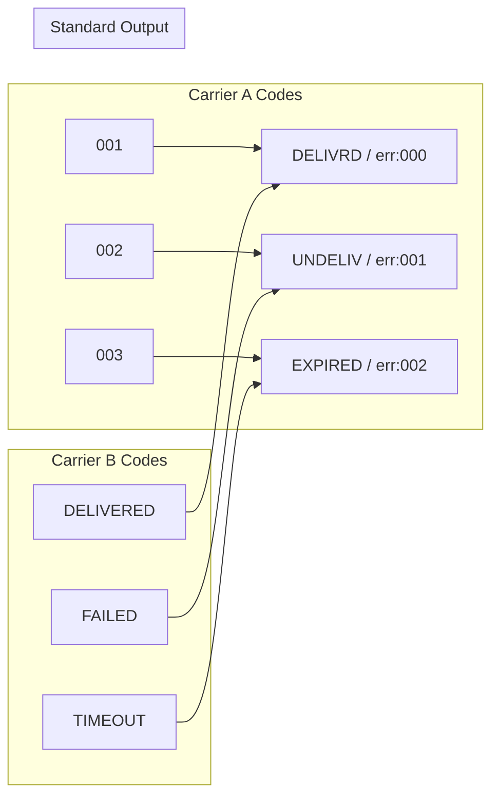
```mermaid
flowchart LR
    subgraph CarrierA[Carrier A Codes]
        A1[001] --> DELIVRD
        A2[002] --> UNDELIV
        A3[003] --> EXPIRED
    end

    subgraph CarrierB[Carrier B Codes]
        B1[DELIVERED] --> DELIVRD
        B2[FAILED] --> UNDELIV
        B3[TIMEOUT] --> EXPIRED
    end

    subgraph Standard[Standard Output]
        DELIVRD[DELIVRD / err:000]
        UNDELIV[UNDELIV / err:001]
        EXPIRED[EXPIRED / err:002]
    end
```

---

## Validity Period Enforcement

Control message expiry and scheduling:

```yaml
validity:
  # Global defaults
  default: 24h                     # Default validity period
  max: 72h                         # Maximum allowed
  min: 5m                          # Minimum allowed

  # Override per client
  clients:
    client-a:
      default: 48h
      max: 168h                    # 1 week

  # Override per upstream
  upstreams:
    carrier-a:
      max: 24h                     # Carrier limit
      override_longer: true        # Reduce if client sends longer

  # Enforcement
  enforcement:
    reject_invalid: true           # Reject if outside min/max
    normalize: true                # Convert to absolute time

  # Scheduled delivery
  scheduling:
    enabled: true
    max_future: 30d                # Max schedule ahead
    timezone: UTC
```

### Validity Period Flow

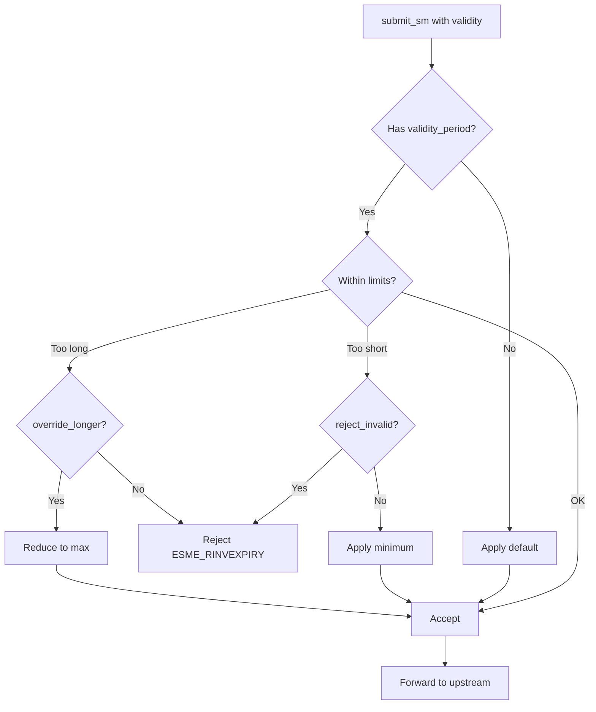
```mermaid
flowchart TD
    A[submit_sm with validity] --> B{Has validity_period?}
    B -->|No| C[Apply default]
    B -->|Yes| D{Within limits?}
    D -->|Too short| E{reject_invalid?}
    D -->|Too long| F{override_longer?}
    D -->|OK| G[Accept]
    E -->|Yes| H[Reject ESME_RINVEXPIRY]
    E -->|No| I[Apply minimum]
    F -->|Yes| J[Reduce to max]
    F -->|No| H
    C --> G
    I --> G
    J --> G
    G --> K[Forward to upstream]
```

### Scheduled Delivery

```yaml
# Client sends scheduled_delivery_time
submit_sm:
  scheduled_delivery_time: "251231120000000+"  # Dec 31, 2025 12:00

# smppd behavior
scheduling:
  # Queue locally until time
  queue:
    enabled: true
    storage: sqlite              # sqlite, redis

  # Or forward to carrier (if supported)
  forward:
    enabled: false
    carriers: [carrier-a]        # Carriers that support scheduling
```

---

## Multipart Handling

### Segmentation and Reassembly

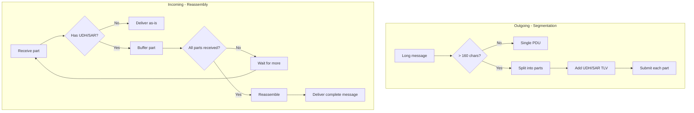
```mermaid
flowchart TB
    subgraph Outgoing[Outgoing - Segmentation]
        O1[Long message] --> O2{> 160 chars?}
        O2 -->|No| O3[Single PDU]
        O2 -->|Yes| O4[Split into parts]
        O4 --> O5[Add UDH/SAR TLV]
        O5 --> O6[Submit each part]
    end

    subgraph Incoming[Incoming - Reassembly]
        I1[Receive part] --> I2{Has UDH/SAR?}
        I2 -->|No| I3[Deliver as-is]
        I2 -->|Yes| I4[Buffer part]
        I4 --> I5{All parts received?}
        I5 -->|No| I6[Wait for more]
        I6 --> I1
        I5 -->|Yes| I7[Reassemble]
        I7 --> I8[Deliver complete message]
    end
```

```yaml
multipart:
  # Reassembly for incoming
  reassembly:
    enabled: true
    timeout: 5m
    max_parts: 20
    buffer_size: 100000

  # Segmentation for outgoing
  segmentation:
    enabled: true
    method: udh  # udh, sar_tlv
    max_parts: 10

  # Reference number
  reference:
    mode: regenerate  # preserve, regenerate, sequential
```

---

## Storage

### Message Storage Architecture

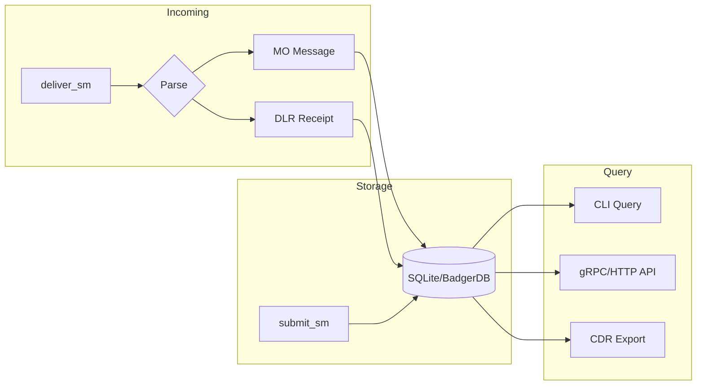
```mermaid
flowchart LR
    subgraph Incoming
        DS[deliver_sm] --> P{Parse}
        P --> MO[MO Message]
        P --> DLR[DLR Receipt]
    end

    subgraph Storage
        MO --> DB[(SQLite/BadgerDB)]
        DLR --> DB
        SS[submit_sm] --> DB
    end

    subgraph Query
        DB --> CLI[CLI Query]
        DB --> API[gRPC/HTTP API]
        DB --> CDR[CDR Export]
    end
```

### Delivery Receipt Flow

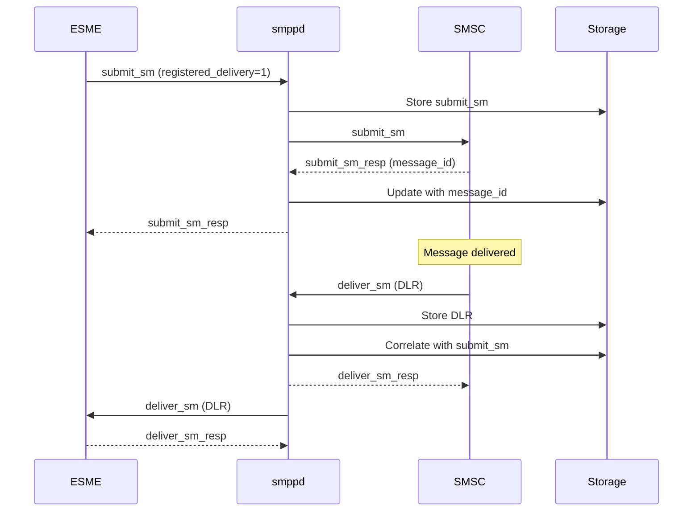
```mermaid
sequenceDiagram
    participant ESME
    participant smppd
    participant SMSC
    participant Storage

    ESME->>smppd: submit_sm (registered_delivery=1)
    smppd->>Storage: Store submit_sm
    smppd->>SMSC: submit_sm
    SMSC-->>smppd: submit_sm_resp (message_id)
    smppd->>Storage: Update with message_id
    smppd-->>ESME: submit_sm_resp

    Note over SMSC: Message delivered

    SMSC->>smppd: deliver_sm (DLR)
    smppd->>Storage: Store DLR
    smppd->>Storage: Correlate with submit_sm
    smppd-->>SMSC: deliver_sm_resp
    smppd->>ESME: deliver_sm (DLR)
    ESME-->>smppd: deliver_sm_resp
```

Local message storage (like smpp-cli daemon):

```yaml
storage:
  enabled: true
  backend: sqlite  # sqlite, badger

  sqlite:
    path: /var/lib/smppd/messages.db
    journal_mode: wal

  # Store received deliver_sm
  deliver_sm:
    enabled: true
    retention: 30d

  # Store submitted messages (for status tracking)
  submit_sm:
    enabled: true
    retention: 7d

  # CDR generation
  cdr:
    enabled: true
    path: /var/log/smppd/cdr
    format: json
    rotation:
      size: 100MB
      time: 1h
```

---

## Observability

### Metrics

```yaml
metrics:
  enabled: true

  prometheus:
    enabled: true
    path: /metrics
    port: 9100
```

Exposed metrics:
- `smppd_connections_active{type,client}`
- `smppd_messages_total{direction,status,upstream,client}`
- `smppd_message_latency_seconds{upstream}`
- `smppd_upstream_health{upstream}`
- `smppd_rate_limit_hits_total{client}`

### Logging

```yaml
logging:
  level: info  # debug, info, warn, error
  format: json  # json, text
  output: stdout  # stdout, file
  file:
    path: /var/log/smppd/smppd.log
    rotation:
      size: 100MB
      max_files: 10
```

### Access Logging

```yaml
access_log:
  - name: file
    path: /var/log/smppd/access.log
    format: |
      [%START_TIME%] %CLIENT% %COMMAND% %SOURCE%->%DESTINATION%
      %UPSTREAM% %RESPONSE_CODE% %DURATION%ms %MESSAGE_ID%

  - name: json
    path: /var/log/smppd/access.json
    format: json
    fields:
      - start_time
      - client
      - command
      - source_addr
      - destination_addr
      - upstream
      - response_code
      - duration_ms
      - message_id
      - parts

  - name: grpc
    endpoint: log-collector:9000
    format: proto
```

Format variables:
- `%START_TIME%` - Request start timestamp
- `%CLIENT%` - Client system_id
- `%COMMAND%` - PDU command (submit_sm, deliver_sm)
- `%SOURCE%` - Source address
- `%DESTINATION%` - Destination address
- `%UPSTREAM%` - Upstream name used
- `%RESPONSE_CODE%` - SMPP response code
- `%DURATION%` - Total duration in ms
- `%MESSAGE_ID%` - Assigned message ID
- `%PARTS%` - Number of parts (multipart)

### Tracing

```yaml
tracing:
  enabled: true

  otlp:
    endpoint: otel-collector:4317

  jaeger:
    endpoint: jaeger:6831
```

---

## Web Dashboard

Built-in web UI for management and monitoring:

```yaml
dashboard:
  enabled: true
  address: :8082
  auth:
    type: basic
    username: admin
    password: admin_password
```

### Dashboard Features

```
┌─────────────────────────────────────────────────────────────────┐
│  smppd Dashboard                                    [admin ▼]   │
├─────────────────────────────────────────────────────────────────┤
│                                                                  │
│  ┌──────────┐  ┌──────────┐  ┌──────────┐  ┌──────────┐        │
│  │ 125,432  │  │  99.2%   │  │  2.3ms   │  │    42    │        │
│  │ Messages │  │ Success  │  │ Latency  │  │ Clients  │        │
│  └──────────┘  └──────────┘  └──────────┘  └──────────┘        │
│                                                                  │
│  [Clients] [Upstreams] [Routes] [Credits] [Logs]               │
│                                                                  │
│  ┌─────────────────────────────────────────────────────────┐   │
│  │  Live Traffic Graph                               [1h ▼] │   │
│  │  ▁▂▃▅▆▇█▇▆▅▄▃▂▁▂▃▄▅▆▇█▇▆▅▄▃▂▁                          │   │
│  └─────────────────────────────────────────────────────────┘   │
│                                                                  │
│  Upstreams                                                      │
│  ┌────────────┬────────┬─────────┬──────────┐                  │
│  │ Name       │ Health │ TPS     │ Latency  │                  │
│  ├────────────┼────────┼─────────┼──────────┤                  │
│  │ carrier-a  │ ● OK   │ 523/s   │ 12ms     │                  │
│  │ carrier-b  │ ● OK   │ 234/s   │ 8ms      │                  │
│  │ backup     │ ○ Idle │ 0/s     │ -        │                  │
│  └────────────┴────────┴─────────┴──────────┘                  │
│                                                                  │
└─────────────────────────────────────────────────────────────────┘
```

- Real-time traffic graphs
- Upstream health status
- Client connections
- Credit balances
- Live log streaming
- Config editor (YAML)

---

## Traffic Management

### A/B Testing

Split traffic between upstreams for testing:

```yaml
routes:
  - name: ab-test-carrier
    match:
      destination_addr: "+258*"
    split:
      - upstream: carrier-a
        weight: 90
      - upstream: carrier-b-new
        weight: 10
    # Track metrics separately
    metrics:
      tag: ab_test_carrier_b
```

### Canary Deployments

Gradual rollout to new upstreams:

```yaml
routes:
  - name: canary-rollout
    match:
      destination_addr: "*"
    canary:
      upstream: new-carrier
      baseline: old-carrier

      # Rollout schedule
      steps:
        - weight: 1      # 1% traffic
          duration: 1h
        - weight: 5
          duration: 2h
        - weight: 25
          duration: 4h
        - weight: 100    # Full rollout

      # Auto-rollback on errors
      rollback:
        error_rate: 0.05     # 5% errors
        latency_p99: 500ms   # p99 > 500ms
```

### Geo Routing

Route by client or destination geography:

```yaml
routes:
  - name: geo-africa
    match:
      destination_addr: "+2*"    # Africa country codes
      client_locality:
        region: africa
    upstream: africa-carrier

  - name: geo-europe
    match:
      destination_addr: "+3*"    # Europe
      destination_addr: "+4*"
    upstream: europe-carrier

  - name: geo-nearest
    match:
      destination_addr: "*"
    upstream: nearest            # Auto-select by latency
```

---

## Security

### SMS Firewall

Content filtering, spam detection, and fraud prevention:

```yaml
firewall:
  enabled: true

  # Content filtering
  content:
    # Block keywords/patterns
    block:
      - pattern: "(?i)\\bcasino\\b"
        action: reject
        reason: "Gambling content blocked"

      - pattern: "(?i)\\bwin\\s+\\$?\\d+\\b"
        action: reject
        reason: "Prize scam pattern"

      - pattern: "(?i)\\bcrypto\\b.*\\binvest\\b"
        action: reject

    # Replace content
    replace:
      - pattern: "(?i)\\bf[u\\*]ck\\b"
        replacement: "****"

    # URL filtering
    urls:
      block_shortened: true          # bit.ly, tinyurl, etc.
      block_unknown: false
      whitelist:
        - "example.com"
        - "myapp.com"
      blacklist:
        - "malware.com"
        - "phishing.net"

  # Spam detection
  spam:
    enabled: true

    # ML-based scoring
    ml:
      enabled: true
      model: /etc/smppd/models/spam.onnx
      threshold: 0.85              # Score > 0.85 = spam

    # Rule-based detection
    rules:
      # Repeated messages
      duplicate:
        window: 1h
        threshold: 10              # Same message 10x in 1h

      # Sender patterns
      sender:
        alphanumeric_only: false   # Block if only alphanumeric
        numeric_short: true        # Allow short codes
        suspicious_patterns:
          - "^\\d{5}$"             # 5-digit sender

      # Message patterns
      message:
        all_caps_ratio: 0.7        # Block if >70% caps
        link_ratio: 0.5            # Block if >50% is links
        special_char_ratio: 0.3    # Block if >30% special chars

  # Fraud detection
  fraud:
    enabled: true

    patterns:
      # Phishing
      - name: bank_phishing
        match:
          content: "(?i)(bank|account).*verify.*click"
        action: reject
        alert: critical

      # OTP interception
      - name: otp_request
        match:
          content: "(?i)send.*your.*(otp|code|pin)"
        action: reject
        alert: high

      # SIM swap
      - name: sim_swap
        match:
          content: "(?i)sim.*swap|port.*number"
        action: reject
        alert: critical

      # Premium rate fraud
      - name: premium_rate
        match:
          destination_addr: "^(900|976|1-900)"
        action: reject

    # Velocity checks
    velocity:
      # Too many destinations
      unique_destinations:
        window: 1m
        threshold: 100
        action: throttle

      # Too many from same source
      same_source:
        window: 1m
        threshold: 500
        action: throttle

  # Classification
  classification:
    enabled: true

    categories:
      - name: otp
        match:
          content: "(?i)(code|otp|verify|\\d{4,8})"
          source_addr_ton: 5
        priority: high
        upstream: otp-carrier

      - name: marketing
        match:
          service_type: "MKTG"
          content: "(?i)(sale|offer|discount|promo)"
        priority: low
        rate_limit: 100/s
        upstream: bulk-carrier

      - name: transactional
        match:
          content: "(?i)(order|shipped|delivery|confirm)"
        priority: normal

  # Alerts
  alerts:
    enabled: true

    channels:
      - type: webhook
        url: https://alerts.example.com/sms-firewall
        events: [critical, high]

      - type: email
        to: security@example.com
        events: [critical]

      - type: slack
        webhook: https://hooks.slack.com/...
        channel: "#sms-alerts"

    # Alert on
    triggers:
      - event: spam_detected
        severity: medium

      - event: fraud_detected
        severity: critical

      - event: velocity_exceeded
        severity: high

      - event: blocked_content
        severity: low
```

### Firewall Flow

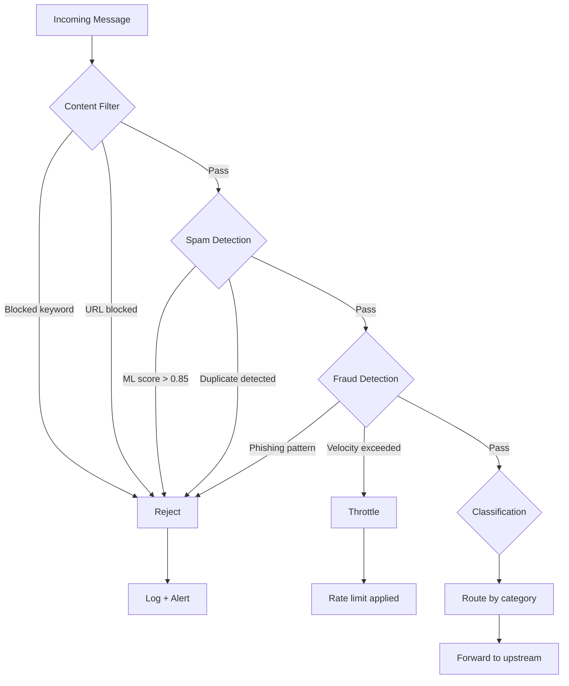
```mermaid
flowchart TD
    A[Incoming Message] --> B{Content Filter}
    B -->|Blocked keyword| R[Reject]
    B -->|URL blocked| R
    B -->|Pass| C{Spam Detection}

    C -->|ML score > 0.85| R
    C -->|Duplicate detected| R
    C -->|Pass| D{Fraud Detection}

    D -->|Phishing pattern| R
    D -->|Velocity exceeded| T[Throttle]
    D -->|Pass| E{Classification}

    E --> F[Route by category]
    F --> G[Forward to upstream]

    R --> H[Log + Alert]
    T --> I[Rate limit applied]
```

### Firewall Metrics

```
smppd_firewall_blocked_total{reason="spam"}
smppd_firewall_blocked_total{reason="fraud"}
smppd_firewall_blocked_total{reason="content"}
smppd_firewall_classified_total{category="otp"}
smppd_firewall_classified_total{category="marketing"}
smppd_firewall_alerts_total{severity="critical"}
smppd_firewall_spam_score_histogram
```

---

### DDoS Protection

Built-in protection against abuse:

```yaml
security:
  ddos:
    enabled: true

    # Connection limits
    connections:
      max_per_ip: 100
      max_per_client: 50
      rate: 100/s              # New connections per second

    # Bind flood protection
    bind:
      max_attempts: 5          # Per IP
      lockout: 5m              # After failed attempts

    # Message flood protection
    submit:
      rate_per_client: 1000/s
      burst: 5000

    # Suspicious patterns
    patterns:
      # Block rapid destination cycling
      destination_rate: 100/s  # Unique destinations per second
      # Block message bombs
      same_destination: 50/s   # Same destination limit

    # Auto-ban
    auto_ban:
      enabled: true
      threshold: 3             # Violations before ban
      duration: 1h

    # IP reputation
    reputation:
      enabled: true
      provider: abuseipdb      # abuseipdb, crowdsec, custom
      block_score: 80
```

### Audit Logging

Compliance-ready audit trail:

```yaml
audit:
  enabled: true
  path: /var/log/smppd/audit.log

  # What to log
  events:
    - bind                     # All bind attempts
    - bind_failure             # Failed binds
    - config_change            # Config modifications
    - credit_change            # Balance changes
    - client_create            # New clients
    - client_delete            # Removed clients
    - upstream_change          # Upstream modifications
    - admin_action             # Admin API calls

  # Retention
  retention:
    days: 365                  # Keep for 1 year
    compress: true

  # External shipping
  ship:
    - type: syslog
      address: syslog.example.com:514
    - type: splunk
      endpoint: https://splunk.example.com
      token: splunk_token
```

Audit log format:
```json
{
  "timestamp": "2025-12-27T10:30:00Z",
  "event": "bind",
  "actor": "192.168.1.100",
  "client": "client-a",
  "result": "success",
  "details": {
    "bind_type": "transceiver",
    "listener": "smpp-main"
  }
}
```

---

## Plugins

### Go Plugins

Extend smppd with Go plugins:

```yaml
plugins:
  path: /etc/smppd/plugins

  load:
    - name: custom-auth
      path: custom_auth.so
      config:
        api_url: https://auth.example.com

    - name: message-enrichment
      path: enrichment.so
```

Plugin interface:

```go
// Plugin interface
type Plugin interface {
    Name() string
    Init(config map[string]any) error
    Close() error
}

// Filter plugin
type FilterPlugin interface {
    Plugin
    OnPDU(ctx context.Context, pdu PDU) (PDU, error)
}

// Auth plugin
type AuthPlugin interface {
    Plugin
    Authenticate(ctx context.Context, bind BindRequest) (bool, error)
}

// Router plugin
type RouterPlugin interface {
    Plugin
    Route(ctx context.Context, msg Message) (string, error)
}
```

### WASM Plugins

Language-agnostic plugins via WebAssembly:

```yaml
plugins:
  wasm:
    - name: custom-filter
      path: /etc/smppd/plugins/filter.wasm
      runtime: wazero           # wazero, wasmtime
      memory: 16MB

    - name: rust-router
      path: /etc/smppd/plugins/router.wasm
```

WASM interface:

```rust
// Rust example
#[no_mangle]
pub extern "C" fn on_submit_sm(ptr: *const u8, len: usize) -> i32 {
    let msg = unsafe { parse_message(ptr, len) };

    // Custom logic
    if msg.destination.starts_with("+999") {
        return REJECT;
    }

    CONTINUE
}
```

---

## High Availability

### Cluster Architecture

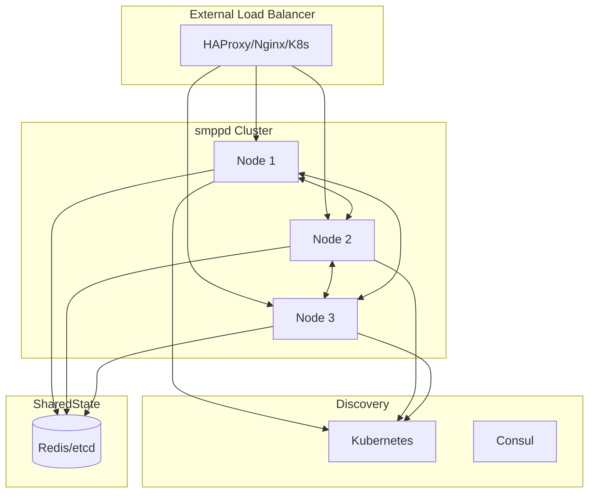
```mermaid
graph TB
    subgraph LoadBalancer[External Load Balancer]
        LB[HAProxy/Nginx/K8s]
    end

    subgraph Cluster[smppd Cluster]
        N1[Node 1]
        N2[Node 2]
        N3[Node 3]
    end

    subgraph Discovery
        K8S[Kubernetes]
        CONSUL[Consul]
    end

    subgraph SharedState
        REDIS[(Redis/etcd)]
    end

    LB --> N1
    LB --> N2
    LB --> N3

    N1 <--> N2
    N2 <--> N3
    N1 <--> N3

    N1 --> K8S
    N2 --> K8S
    N3 --> K8S

    N1 --> REDIS
    N2 --> REDIS
    N3 --> REDIS
```

### Dynamic Configuration

```yaml
config:
  # File-based (default)
  file:
    path: /etc/smppd/smppd.yaml
    watch: true              # Auto-reload on change

  # Or gRPC streaming from config server
  streaming:
    address: config.example.com:9000
    tls:
      enabled: true
      ca: /etc/smppd/certs/ca.crt
    node_id: smppd-node-1
    resources:
      - listeners
      - upstreams
      - routes
      - clients
```

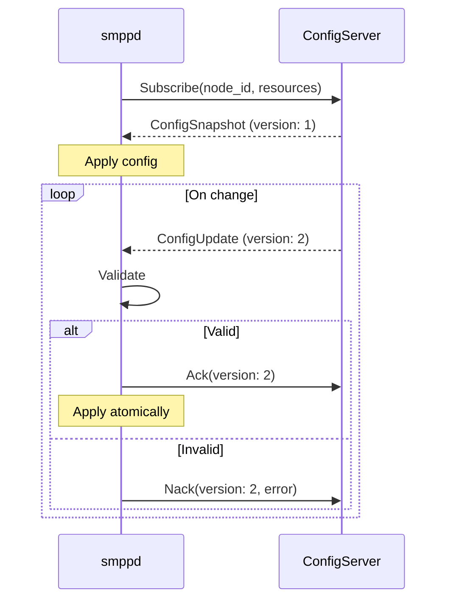
```mermaid
sequenceDiagram
    participant smppd
    participant ConfigServer

    smppd->>ConfigServer: Subscribe(node_id, resources)
    ConfigServer-->>smppd: ConfigSnapshot (version: 1)
    Note over smppd: Apply config

    loop On change
        ConfigServer-->>smppd: ConfigUpdate (version: 2)
        smppd->>smppd: Validate
        alt Valid
            smppd->>ConfigServer: Ack(version: 2)
            Note over smppd: Apply atomically
        else Invalid
            smppd->>ConfigServer: Nack(version: 2, error)
        end
    end
```

**Config Service (proto):**

```protobuf
service ConfigService {
  // Bidirectional stream for config sync
  rpc Stream(stream ConfigRequest) returns (stream ConfigResponse);
}

// --------------------------------------------------------------------------
// Request (client -> server)
// --------------------------------------------------------------------------

message ConfigRequest {
  // Node identification
  Node node = 1;

  // Resource type being requested
  string resource_type = 2;  // listener, upstream, route, client

  // Subscribed resource names (empty = all)
  repeated string resource_names = 3;

  // Last received version (for resumption)
  string version_info = 4;

  // Response acknowledgement
  oneof ack {
    string ack_version = 5;    // Successfully applied
    NackDetails nack = 6;      // Rejected with error
  }

  // Delta mode
  bool delta = 7;
}

message Node {
  string id = 1;
  string cluster = 2;
  map<string, string> metadata = 3;
  Locality locality = 4;
}

message Locality {
  string region = 1;
  string zone = 2;
}

message NackDetails {
  string version = 1;
  string message = 2;
  repeated ResourceError errors = 3;
}

message ResourceError {
  string name = 1;
  string error = 2;
}

// --------------------------------------------------------------------------
// Response (server -> client)
// --------------------------------------------------------------------------

message ConfigResponse {
  // Resource type
  string resource_type = 1;

  // Version of this response
  string version_info = 2;

  // Full state (sotw mode)
  repeated Resource resources = 3;

  // Delta updates
  repeated Resource added = 4;
  repeated string removed = 5;

  // Control plane identifier
  string control_plane = 6;
}

message Resource {
  // Resource name (unique within type)
  string name = 1;

  // Resource version (for per-resource tracking)
  string version = 2;

  // Resource data
  oneof resource {
    Listener listener = 3;
    Upstream upstream = 4;
    Route route = 5;
    Client client = 6;
  }

  // Time-to-live (0 = no expiry)
  google.protobuf.Duration ttl = 7;

  // Cache control
  CacheControl cache = 8;
}

message CacheControl {
  bool do_not_cache = 1;
}

// --------------------------------------------------------------------------
// Resource Types
// --------------------------------------------------------------------------

message Listener {
  string name = 1;
  string type = 2;              // smpp, http, grpc
  string address = 3;
  TlsConfig tls = 4;
  map<string, string> options = 5;
}

message Upstream {
  string name = 1;
  repeated Host hosts = 2;
  BindConfig bind = 3;
  TlsConfig tls = 4;
  PoolConfig pool = 5;
  HealthCheckConfig health = 6;
  CircuitBreakerConfig circuit_breaker = 7;
  OutlierDetectionConfig outlier_detection = 8;
}

message Host {
  string address = 1;
  uint32 weight = 2;
  uint32 priority = 3;
  BindConfig bind = 4;          // Per-host override
  HealthState health = 5;
}

message Route {
  string name = 1;
  uint32 priority = 2;
  RouteMatch match = 3;
  string upstream = 4;
  string failover = 5;
}

message Client {
  string system_id = 1;
  string password_hash = 2;
  repeated string allowed_ips = 3;
  RateLimitConfig rate_limit = 4;
}
```

**Features:**

| Feature | Description |
|---------|-------------|
| **Bidirectional stream** | Single stream for requests and responses |
| **Resource types** | listener, upstream, route, client |
| **Sotw + Delta** | Full state or incremental updates |
| **Per-resource versioning** | Track each resource independently |
| **Resource names** | Subscribe to specific resources |
| **Ack/Nack** | Confirm or reject with error details |
| **TTL** | Resources can expire |
| **Locality** | Region/zone aware placement |
| **Warming** | New resources validated before use |
| **Dependency order** | Upstreams before routes |

```mermaid
sequenceDiagram
    participant smppd
    participant ControlPlane

    smppd->>ControlPlane: ConfigRequest(type=upstream)
    ControlPlane-->>smppd: ConfigResponse(upstreams, v1)
    smppd->>ControlPlane: ConfigRequest(ack=v1, type=route)
    ControlPlane-->>smppd: ConfigResponse(routes, v1)
    smppd->>ControlPlane: ConfigRequest(ack=v1)

    Note over smppd: Config applied

    ControlPlane-->>smppd: ConfigResponse(delta, added=[upstream-x])
    smppd->>smppd: Warm upstream-x
    smppd->>ControlPlane: ConfigRequest(ack=v2)
```

- Upstreams loaded before routes (dependency)
- New upstreams warmed before traffic
- Delta updates for efficiency
- Graceful drain on removals

### Clustering

```yaml
cluster:
  enabled: true
  node_id: node-1

  discovery:
    method: kubernetes  # kubernetes, consul, static
    kubernetes:
      namespace: smpp
      service: smppd

  sync:
    sessions: true
    messages: true
    config: true
```

### Failover

```yaml
upstreams:
  - name: carrier-a
    hosts:
      - address: smsc1.carrier-a.com:2775
        priority: 1
      - address: smsc2.carrier-a.com:2775
        priority: 2  # Backup

    failover:
      threshold: 3  # Consecutive failures
      recovery_time: 60s

routes:
  - name: primary
    match:
      destination_addr: "*"
    upstream: carrier-a
    failover: backup  # Fallback upstream
```

---

## Management API

```yaml
management:
  enabled: true
  address: :8081

  # Optional auth
  auth:
    type: basic
    username: admin
    password: admin_password
```

Endpoints:
```
# Status & Debug (Envoy-style)
GET  /ready                   - Readiness probe
GET  /live                    - Liveness probe
GET  /config_dump             - Full configuration dump
GET  /stats                   - All metrics (Prometheus)
GET  /stats?filter=upstream   - Filtered metrics
GET  /stats?format=json       - JSON format

# Runtime control
POST /drain                   - Start graceful drain
POST /drain?timeout=30s       - Drain with timeout
POST /logging?level=debug     - Change log level

# Clients
GET  /api/clients             - List clients
GET  /api/clients/{id}        - Client details
DELETE /api/clients/{id}      - Disconnect client

# Upstreams
GET  /api/upstreams           - List upstreams
GET  /api/upstreams/{name}    - Upstream details
POST /api/upstreams/{name}/suspend
POST /api/upstreams/{name}/resume
POST /api/upstreams/{name}/drain    - Drain upstream

# Routes
GET  /api/routes              - List routes
POST /api/routes/test         - Test route matching

# Config
POST /api/config/reload       - Reload configuration
GET  /api/config/validate     - Validate config file
```

---

## CLI

```bash
# Start daemon
$ smppd --config /etc/smppd/smppd.yaml

# Validate config
$ smppd validate --config /etc/smppd/smppd.yaml

# Show status
$ smppd status

# Client management
$ smppd client list
$ smppd client disconnect client-a

# Upstream management
$ smppd upstream list
$ smppd upstream suspend carrier-a
$ smppd upstream resume carrier-a
$ smppd upstream test carrier-a

# Route management
$ smppd route list
$ smppd route test "+258841234567"  # Show which route matches

# Statistics
$ smppd stats
$ smppd stats --client client-a
$ smppd stats --upstream carrier-a

# CDR
$ smppd cdr export --from 2025-12-01 --to 2025-12-27
```

---

## Deployment

### Deployment Options

```mermaid
graph TB
    subgraph Binary[Binary Deployment]
        BIN[smppd binary]
        SYSTEMD[systemd service]
        BIN --> SYSTEMD
    end

    subgraph Container[Container Deployment]
        DOCKER[Docker]
        COMPOSE[Docker Compose]
        DOCKER --> COMPOSE
    end

    subgraph Orchestration[Kubernetes Deployment]
        DEPLOY[Deployment]
        SVC[Service]
        HPA[HPA]
        CM[ConfigMap]
        SEC[Secret]
        DEPLOY --> SVC
        DEPLOY --> HPA
        CM --> DEPLOY
        SEC --> DEPLOY
    end
```

### Binary

```bash
$ curl -sSL https://get.katembe.io/smppd | sh
$ smppd --config /etc/smppd/smppd.yaml
```

### Docker

```yaml
# docker-compose.yaml
services:
  smppd:
    image: getkatembe/smppd:latest
    ports:
      - "2775:2775"
      - "8775:8775"
      - "8080:8080"
    volumes:
      - ./smppd.yaml:/etc/smppd/smppd.yaml
      - ./certs:/etc/smppd/certs
    environment:
      - LOG_LEVEL=info
```

### Kubernetes

```yaml
apiVersion: apps/v1
kind: Deployment
metadata:
  name: smppd
spec:
  replicas: 3
  template:
    spec:
      containers:
        - name: smppd
          image: getkatembe/smppd:latest
          ports:
            - containerPort: 2775
            - containerPort: 8080
          volumeMounts:
            - name: config
              mountPath: /etc/smppd
          readinessProbe:
            httpGet:
              path: /health
              port: 8080
```

### Systemd

```ini
# /etc/systemd/system/smppd.service
[Unit]
Description=SMPP Daemon
After=network.target

[Service]
Type=simple
ExecStart=/usr/local/bin/smppd --config /etc/smppd/smppd.yaml
Restart=always
RestartSec=5

[Install]
WantedBy=multi-user.target
```

---

## Protocol Buffers

### Service Overview

```mermaid
graph LR
    subgraph SmppService
        S1[Submit]
        S2[SubmitBatch]
        S3[Query]
        S4[Cancel]
    end

    subgraph DeliveryService
        D1[StreamDeliveries]
        D2[ListDeliveries]
        D3[GetDelivery]
        D4[AckDelivery]
    end

    subgraph ManagementService
        M1[GetStatus]
        M2[ListClients]
        M3[ListUpstreams]
        M4[ListRoutes]
        M5[ReloadConfig]
    end
```

### api/smppd/v1/smppd.proto

```protobuf
syntax = "proto3";

package smppd.v1;

option go_package = "github.com/getkatembe/smppd/api/smppd/v1;smppd";

import "google/protobuf/timestamp.proto";
import "google/protobuf/duration.proto";

// =============================================================================
// SMPP Service - Message submission and query
// =============================================================================

service SmppService {
  // Submit a single message
  rpc Submit(SubmitRequest) returns (SubmitResponse);

  // Submit multiple messages in batch
  rpc SubmitBatch(SubmitBatchRequest) returns (SubmitBatchResponse);

  // Query message status
  rpc Query(QueryRequest) returns (QueryResponse);

  // Cancel a pending message
  rpc Cancel(CancelRequest) returns (CancelResponse);
}

// -----------------------------------------------------------------------------
// Submit
// -----------------------------------------------------------------------------

message SubmitRequest {
  // Source address (sender ID)
  Address source = 1;

  // Destination address
  Address destination = 2;

  // Message content
  oneof content {
    string text = 3;           // Text message (auto-encoded)
    bytes data = 4;            // Binary data
  }

  // Data coding scheme (0=GSM7, 8=UCS2, 4=binary)
  uint32 data_coding = 5;

  // Request delivery receipt
  RegisteredDelivery registered_delivery = 6;

  // Validity period
  google.protobuf.Duration validity_period = 7;

  // Scheduled delivery time
  google.protobuf.Timestamp scheduled_time = 8;

  // Service type
  string service_type = 9;

  // Protocol ID
  uint32 protocol_id = 10;

  // Priority flag (0-3)
  uint32 priority = 11;

  // Optional TLVs
  repeated TLV tlvs = 12;

  // Client reference (for correlation)
  string client_ref = 13;

  // Force specific upstream
  string upstream = 14;
}

message SubmitResponse {
  // Message ID assigned by SMSC
  string message_id = 1;

  // Internal tracking ID
  string tracking_id = 2;

  // Number of parts (for multipart)
  uint32 parts = 3;

  // Part message IDs (for multipart)
  repeated string part_message_ids = 4;

  // Upstream used
  string upstream = 5;
}

// -----------------------------------------------------------------------------
// Submit Batch
// -----------------------------------------------------------------------------

message SubmitBatchRequest {
  // Common settings for all messages
  Address source = 1;
  uint32 data_coding = 2;
  RegisteredDelivery registered_delivery = 3;
  string service_type = 4;

  // Individual messages
  repeated BatchMessage messages = 5;
}

message BatchMessage {
  Address destination = 1;
  string text = 2;
  string client_ref = 3;
}

message SubmitBatchResponse {
  // Results for each message
  repeated BatchResult results = 1;

  // Summary
  uint32 total = 2;
  uint32 accepted = 3;
  uint32 rejected = 4;
}

message BatchResult {
  uint32 index = 1;
  bool success = 2;
  string message_id = 3;
  string tracking_id = 4;
  string error = 5;
  uint32 error_code = 6;
}

// -----------------------------------------------------------------------------
// Query
// -----------------------------------------------------------------------------

message QueryRequest {
  // Query by message ID
  string message_id = 1;

  // Or query by tracking ID
  string tracking_id = 2;
}

message QueryResponse {
  string message_id = 1;
  string tracking_id = 2;
  MessageState state = 3;
  string error = 4;
  google.protobuf.Timestamp submit_time = 5;
  google.protobuf.Timestamp done_time = 6;
}

// -----------------------------------------------------------------------------
// Cancel
// -----------------------------------------------------------------------------

message CancelRequest {
  string message_id = 1;
  Address source = 2;
  Address destination = 3;
}

message CancelResponse {
  bool success = 1;
  string error = 2;
}

// =============================================================================
// Delivery Service - MO and DLR handling
// =============================================================================

service DeliveryService {
  // Stream incoming deliveries (MO + DLR)
  rpc StreamDeliveries(StreamDeliveriesRequest) returns (stream Delivery);

  // List stored deliveries
  rpc ListDeliveries(ListDeliveriesRequest) returns (ListDeliveriesResponse);

  // Get a specific delivery
  rpc GetDelivery(GetDeliveryRequest) returns (Delivery);

  // Acknowledge delivery (remove from pending)
  rpc AckDelivery(AckDeliveryRequest) returns (AckDeliveryResponse);
}

message StreamDeliveriesRequest {
  // Filter by type
  DeliveryType type = 1;  // ALL, MO, DLR

  // Filter by client
  string client = 2;

  // Auto-acknowledge on receive
  bool auto_ack = 3;
}

message Delivery {
  // Unique ID
  string id = 1;

  // Type: MO or DLR
  DeliveryType type = 2;

  // Source address
  Address source = 3;

  // Destination address
  Address destination = 4;

  // Message content (for MO)
  string text = 5;
  bytes data = 6;
  uint32 data_coding = 7;

  // DLR fields
  string message_id = 8;         // Original message ID
  MessageState state = 9;        // Delivery state
  string error = 10;             // Error description
  uint32 error_code = 11;        // SMPP error code

  // Timestamps
  google.protobuf.Timestamp received_at = 12;
  google.protobuf.Timestamp submit_time = 13;    // For DLR
  google.protobuf.Timestamp done_time = 14;      // For DLR

  // TLVs
  repeated TLV tlvs = 15;

  // Metadata
  string upstream = 16;
  string client = 17;
}

message ListDeliveriesRequest {
  DeliveryType type = 1;
  string client = 2;
  google.protobuf.Timestamp from = 3;
  google.protobuf.Timestamp to = 4;
  uint32 limit = 5;
  string cursor = 6;
}

message ListDeliveriesResponse {
  repeated Delivery deliveries = 1;
  string next_cursor = 2;
  uint32 total = 3;
}

message GetDeliveryRequest {
  string id = 1;
}

message AckDeliveryRequest {
  repeated string ids = 1;
}

message AckDeliveryResponse {
  uint32 acknowledged = 1;
}

// =============================================================================
// Management Service - Status and control
// =============================================================================

service ManagementService {
  // Get daemon status
  rpc GetStatus(GetStatusRequest) returns (StatusResponse);

  // List connected clients
  rpc ListClients(ListClientsRequest) returns (ListClientsResponse);

  // Disconnect a client
  rpc DisconnectClient(DisconnectClientRequest) returns (DisconnectClientResponse);

  // List upstreams
  rpc ListUpstreams(ListUpstreamsRequest) returns (ListUpstreamsResponse);

  // Control upstream
  rpc ControlUpstream(ControlUpstreamRequest) returns (ControlUpstreamResponse);

  // List routes
  rpc ListRoutes(ListRoutesRequest) returns (ListRoutesResponse);

  // Test route matching
  rpc TestRoute(TestRouteRequest) returns (TestRouteResponse);

  // Reload configuration
  rpc ReloadConfig(ReloadConfigRequest) returns (ReloadConfigResponse);

  // Get metrics
  rpc GetMetrics(GetMetricsRequest) returns (GetMetricsResponse);
}

// -----------------------------------------------------------------------------
// Status
// -----------------------------------------------------------------------------

message GetStatusRequest {}

message StatusResponse {
  string version = 1;
  string node_id = 2;
  google.protobuf.Timestamp started_at = 3;
  google.protobuf.Duration uptime = 4;

  // Listeners
  repeated ListenerStatus listeners = 5;

  // Upstreams
  repeated UpstreamStatus upstreams = 6;

  // Counts
  uint64 total_submitted = 7;
  uint64 total_delivered = 8;
  uint64 total_failed = 9;
  uint32 active_connections = 10;
}

message ListenerStatus {
  string name = 1;
  string type = 2;
  string address = 3;
  bool tls = 4;
  uint32 connections = 5;
}

message UpstreamStatus {
  string name = 1;
  HealthState health = 2;
  uint32 active_connections = 3;
  uint32 pool_size = 4;
  uint64 messages_sent = 5;
  uint64 messages_failed = 6;
  google.protobuf.Duration avg_latency = 7;
}

// -----------------------------------------------------------------------------
// Clients
// -----------------------------------------------------------------------------

message ListClientsRequest {}

message ListClientsResponse {
  repeated ClientInfo clients = 1;
}

message ClientInfo {
  string system_id = 1;
  string bind_type = 2;
  string remote_addr = 3;
  string listener = 4;
  google.protobuf.Timestamp connected_at = 5;
  uint64 messages_submitted = 6;
  uint64 messages_delivered = 7;
  uint32 window_size = 8;
  uint32 window_used = 9;
}

message DisconnectClientRequest {
  string system_id = 1;
  string reason = 2;
}

message DisconnectClientResponse {
  uint32 disconnected = 1;
}

// -----------------------------------------------------------------------------
// Upstreams
// -----------------------------------------------------------------------------

message ListUpstreamsRequest {}

message ListUpstreamsResponse {
  repeated UpstreamInfo upstreams = 1;
}

message UpstreamInfo {
  string name = 1;
  HealthState health = 2;
  bool suspended = 3;
  repeated HostInfo hosts = 4;
  UpstreamStats stats = 5;
}

message HostInfo {
  string address = 1;
  HealthState health = 2;
  uint32 weight = 3;
  uint32 priority = 4;
  uint32 active_connections = 5;
}

message UpstreamStats {
  uint64 messages_sent = 1;
  uint64 messages_failed = 2;
  uint64 messages_throttled = 3;
  google.protobuf.Duration avg_latency = 4;
  google.protobuf.Duration p99_latency = 5;
}

message ControlUpstreamRequest {
  string name = 1;
  UpstreamAction action = 2;
}

enum UpstreamAction {
  UPSTREAM_ACTION_UNSPECIFIED = 0;
  UPSTREAM_ACTION_SUSPEND = 1;
  UPSTREAM_ACTION_RESUME = 2;
  UPSTREAM_ACTION_RECONNECT = 3;
}

message ControlUpstreamResponse {
  bool success = 1;
  string error = 2;
}

// -----------------------------------------------------------------------------
// Routes
// -----------------------------------------------------------------------------

message ListRoutesRequest {}

message ListRoutesResponse {
  repeated RouteInfo routes = 1;
}

message RouteInfo {
  string name = 1;
  uint32 priority = 2;
  string match_expr = 3;
  string upstream = 4;
  string failover = 5;
  uint64 messages_routed = 6;
}

message TestRouteRequest {
  string destination_addr = 1;
  string source_addr = 2;
  string client = 3;
  string service_type = 4;
}

message TestRouteResponse {
  string matched_route = 1;
  string upstream = 2;
  string failover = 3;
}

// -----------------------------------------------------------------------------
// Config
// -----------------------------------------------------------------------------

message ReloadConfigRequest {
  bool validate_only = 1;
}

message ReloadConfigResponse {
  bool success = 1;
  repeated string errors = 2;
  repeated string warnings = 3;
}

// -----------------------------------------------------------------------------
// Metrics
// -----------------------------------------------------------------------------

message GetMetricsRequest {
  string format = 1;  // prometheus, json
}

message GetMetricsResponse {
  string content_type = 1;
  bytes data = 2;
}

// =============================================================================
// Common Types
// =============================================================================

message Address {
  string addr = 1;
  uint32 ton = 2;   // Type of Number
  uint32 npi = 3;   // Numbering Plan Indicator
}

message TLV {
  uint32 tag = 1;
  bytes value = 2;
}

enum RegisteredDelivery {
  REGISTERED_DELIVERY_NONE = 0;
  REGISTERED_DELIVERY_SUCCESS = 1;
  REGISTERED_DELIVERY_FAILURE = 2;
  REGISTERED_DELIVERY_BOTH = 3;
}

enum MessageState {
  MESSAGE_STATE_UNKNOWN = 0;
  MESSAGE_STATE_ENROUTE = 1;
  MESSAGE_STATE_DELIVERED = 2;
  MESSAGE_STATE_EXPIRED = 3;
  MESSAGE_STATE_DELETED = 4;
  MESSAGE_STATE_UNDELIVERABLE = 5;
  MESSAGE_STATE_ACCEPTED = 6;
  MESSAGE_STATE_REJECTED = 7;
  MESSAGE_STATE_SKIPPED = 8;
}

enum DeliveryType {
  DELIVERY_TYPE_ALL = 0;
  DELIVERY_TYPE_MO = 1;
  DELIVERY_TYPE_DLR = 2;
}

enum HealthState {
  HEALTH_STATE_UNKNOWN = 0;
  HEALTH_STATE_HEALTHY = 1;
  HEALTH_STATE_DEGRADED = 2;
  HEALTH_STATE_UNHEALTHY = 3;
}
```

### buf.yaml

```yaml
version: v2
modules:
  - path: api
    name: buf.build/getkatembe/smppd
deps:
  - buf.build/googleapis/googleapis
lint:
  use:
    - DEFAULT
breaking:
  use:
    - FILE
```

---

## Package Structure

### Module Dependencies

```mermaid
graph TB
    CMD[cmd/smppd] --> SERVER[internal/server]
    CMD --> CONFIG[internal/config]

    SERVER --> LISTENER[internal/listener]
    SERVER --> UPSTREAM[internal/upstream]
    SERVER --> ROUTER[internal/router]
    SERVER --> MW[internal/middleware]
    SERVER --> STORAGE[internal/storage]
    SERVER --> CLUSTER[internal/cluster]
    SERVER --> API[internal/api]

    LISTENER --> MW
    MW --> ROUTER
    ROUTER --> UPSTREAM

    LISTENER --> SMPPGO[smpp-go]
    UPSTREAM --> SMPPGO

    STORAGE --> SQLITE[modernc.org/sqlite]
```

```
smppd/
├── cmd/
│   └── smppd/
│       └── main.go
├── internal/
│   ├── server/
│   │   ├── server.go
│   │   └── listener.go
│   ├── listener/
│   │   ├── smpp.go
│   │   ├── http.go
│   │   └── grpc.go
│   ├── upstream/
│   │   ├── pool.go
│   │   ├── connection.go
│   │   ├── health.go
│   │   └── loadbalancer.go
│   ├── router/
│   │   ├── engine.go
│   │   ├── matcher.go
│   │   ├── cost.go
│   │   ├── mnp.go
│   │   └── lua.go
│   ├── middleware/
│   │   ├── chain.go
│   │   ├── auth.go
│   │   ├── rate_limit.go
│   │   ├── address_filter.go
│   │   ├── transform.go
│   │   └── metrics.go
│   ├── client/
│   │   ├── registry.go
│   │   └── auth.go
│   ├── storage/
│   │   ├── storage.go
│   │   ├── sqlite.go
│   │   └── cdr.go
│   ├── cluster/
│   │   ├── cluster.go
│   │   └── sync.go
│   ├── api/
│   │   ├── server.go
│   │   └── handlers.go
│   └── config/
│       ├── config.go
│       └── loader.go
├── api/
│   └── smppd/
│       └── v1/
│           └── smppd.proto
└── configs/
    ├── minimal.yaml
    ├── gateway.yaml
    ├── router.yaml
    └── full.yaml
```

---

## Example Configurations

### Minimal (Proxy)

```yaml
# Simplest: SMPP proxy
listeners:
  - type: smpp
    address: :2775

upstreams:
  - name: smsc
    hosts:
      - address: smsc.provider.com:2775
    bind:
      system_id: myuser
      password: mypass

routes:
  - match: { destination_addr: "*" }
    upstream: smsc
```

### Gateway (HTTP → SMPP)

```yaml
# HTTP API to SMPP
listeners:
  - type: http
    address: :8080

upstreams:
  - name: smsc
    hosts:
      - address: smsc.provider.com:2775
    bind:
      system_id: myuser
      password: mypass

routes:
  - match: { destination_addr: "*" }
    upstream: smsc

clients:
  - system_id: api-user
    password: api-pass
```

### Load Balancer

```yaml
# Multiple SMSCs with load balancing
listeners:
  - type: smpp
    address: :2775

upstreams:
  - name: pool
    hosts:
      - address: smsc1.provider.com:2775
        weight: 100
      - address: smsc2.provider.com:2775
        weight: 100
      - address: smsc3.provider.com:2775
        weight: 50
    bind:
      system_id: myuser
      password: mypass
    load_balancing:
      algorithm: weighted_round_robin

routes:
  - match: { destination_addr: "*" }
    upstream: pool
```

### Full Router

```yaml
# Multi-carrier routing
listeners:
  - type: smpp
    address: :2775
  - type: http
    address: :8080

upstreams:
  - name: carrier-a
    hosts:
      - address: smsc.carrier-a.com:2775
    bind:
      system_id: carrier_a_user
      password: carrier_a_pass

  - name: carrier-b
    hosts:
      - address: smsc.carrier-b.com:2775
    bind:
      system_id: carrier_b_user
      password: carrier_b_pass

  - name: backup
    hosts:
      - address: backup.smsc.com:2775
    bind:
      system_id: backup_user
      password: backup_pass

routes:
  - name: mozambique
    match: { destination_addr: "+258*" }
    upstream: carrier-a

  - name: south-africa
    match: { destination_addr: "+27*" }
    upstream: carrier-b

  - name: default
    match: { destination_addr: "*" }
    upstream: carrier-a
    failover: backup

clients:
  - system_id: client-a
    password: client_a_pass
    rate_limit: { messages_per_second: 1000 }

  - system_id: client-b
    password: client_b_pass
    rate_limit: { messages_per_second: 100 }
```

---

## Feature Comparison: smppd vs Melrose SMPP Router

### The Verdict: smppd Wins 30-0

| Category | Feature | Melrose Router | smppd | Winner |
|----------|---------|---------------|-------|--------|
| **Licensing** |
| | Open Source | ✗ Closed binaries | ✓ Apache 2.0 | 🏆 smppd |
| | Free Forever | ✗ Trial expires Sep 2025 | ✓ Forever free | 🏆 smppd |
| | TPS Limits | ✗ £375-£1500 per tier | ✓ Unlimited | 🏆 smppd |
| | No Vendor Lock-in | ✗ Proprietary | ✓ Own your infra | 🏆 smppd |
| **Deployment** |
| | Docker | ✗ Manual install | ✓ Official images | 🏆 smppd |
| | Kubernetes | ✗ "On request" | ✓ Helm charts | 🏆 smppd |
| | Cloud-native | ✗ On-prem focus | ✓ Built for cloud | 🏆 smppd |
| | Hot Restart | ✗ Downtime required | ✓ Zero-downtime | 🏆 smppd |
| | Multi-platform | ✗ Linux only | ✓ Linux/macOS/Windows | 🏆 smppd |
| **UI/UX** |
| | Web Dashboard | ✗ "Not GUI-driven" | ✓ Built-in UI | 🏆 smppd |
| | Real-time Graphs | ✗ External only | ✓ Live dashboard | 🏆 smppd |
| | Config Editor | ✗ Files only | ✓ Web + files | 🏆 smppd |
| **Protocol** |
| | SMPP v3.3 | ✗ Not mentioned | ✓ Full support | 🏆 smppd |
| | SMPP v3.4 | ✓ | ✓ | Tie |
| | SMPP v5.0 | ✓ | ✓ | Tie |
| | gRPC API | ✗ | ✓ Full API | 🏆 smppd |
| | HTTP API | ✓ £250/API extra | ✓ Included | 🏆 smppd |
| **Configuration** |
| | Static Config | ✓ | ✓ | Tie |
| | Dynamic Streaming | ✗ | ✓ gRPC stream | 🏆 smppd |
| | Hot Reload | ✗ | ✓ Zero-drop | 🏆 smppd |
| | Version Control | ✗ | ✓ GitOps ready | 🏆 smppd |
| **Extensibility** |
| | Lua Scripting | ✗ | ✓ Custom logic | 🏆 smppd |
| | Go Plugins | ✗ | ✓ Native plugins | 🏆 smppd |
| | WASM Plugins | ✗ | ✓ Any language | 🏆 smppd |
| **Observability** |
| | Prometheus | ✓ | ✓ | Tie |
| | Grafana | ✓ | ✓ | Tie |
| | OpenTelemetry | ✗ | ✓ | 🏆 smppd |
| | Jaeger/Zipkin | ✗ | ✓ | 🏆 smppd |
| | Access Logging | ✗ | ✓ Templated | 🏆 smppd |
| **Advanced Routing** |
| | A/B Testing | ✗ | ✓ Traffic split | 🏆 smppd |
| | Canary Deploy | ✗ | ✓ Auto-rollback | 🏆 smppd |
| | Geo Routing | ✗ | ✓ Region/zone | 🏆 smppd |
| | Cost Optimization | ? | ✓ Least-cost | 🏆 smppd |
| **Security** |
| | DDoS Protection | ✗ | ✓ Built-in | 🏆 smppd |
| | Audit Logging | ✗ | ✓ Compliance | 🏆 smppd |
| | IP Reputation | ✗ | ✓ AbuseIPDB | 🏆 smppd |
| | mTLS | ? | ✓ Full support | 🏆 smppd |
| **Resilience** |
| | Circuit Breaker | ✗ | ✓ Envoy-style | 🏆 smppd |
| | Outlier Detection | ✗ | ✓ Auto-eject | 🏆 smppd |
| | Maintenance Windows | ✓ | ✓ Cron-based | Tie |
| **Performance** |
| | Max TPS | 5,000 | 10,000+ | 🏆 smppd |
| | Latency | ? | <10ms p99 | 🏆 smppd |
| **Cost** |
| | License | £375-£1500+ | $0 | 🏆 smppd |
| | Support | £345/year | Community | 🏆 smppd |
| | HTTP APIs | £250 each | Included | 🏆 smppd |
| | Total 3yr Cost | £2000-£5000+ | $0 | 🏆 smppd |

### What They Say vs What We Do

| Melrose Claim | smppd Reality |
|---------------|---------------|
| "5,000 TPS" | **10,000+ TPS** - 2x faster |
| "Not GUI-driven" | **Full Web Dashboard** - their weakness is our strength |
| "Backend-first" | **Backend + Frontend** - best of both |
| "Perpetual license" | **Apache 2.0** - truly perpetual, truly free |
| "£345/year support" | **Community + source code** - fix it yourself |
| "Debian 12 only" | **Any Linux + Docker + K8s** - run anywhere |
| "90-day trial" | **Forever free** - no trial, no expiry |

---

## Feature Comparison: smppd vs Melrose SMPP Load Balancer

### The Verdict: smppd Wins 35-0

| Category | Feature | Melrose LB | smppd | Winner |
|----------|---------|-----------|-------|--------|
| **Licensing** |
| | Open Source | ✗ Closed binaries | ✓ Apache 2.0 | 🏆 smppd |
| | Free Forever | ✗ £1,995-£4,995 license | ✓ Forever free | 🏆 smppd |
| | TPS Limits | ✗ 200/1000/5000 tiers | ✓ Unlimited | 🏆 smppd |
| | Upstream Limits | ✗ 25/50/100 servers | ✓ Unlimited | 🏆 smppd |
| | Annual Maintenance | ✗ £525/year | ✓ $0 | 🏆 smppd |
| **Modes** |
| | Proxy Mode | ✓ | ✓ | Tie |
| | Multiplex Mode | ✓ | ✓ | Tie |
| | Gateway Mode | ✗ Separate product | ✓ Included | 🏆 smppd |
| | Router Mode | ✗ Separate product | ✓ Included | 🏆 smppd |
| **Protocol** |
| | SMPP v3.3 | ✓ | ✓ | Tie |
| | SMPP v3.4 | ✓ | ✓ | Tie |
| | SMPP v5.0 | ✓ | ✓ | Tie |
| | TLS/mTLS | ✓ (paid tiers) | ✓ All tiers | 🏆 smppd |
| | gRPC API | ✗ | ✓ | 🏆 smppd |
| | HTTP API | ✗ | ✓ | 🏆 smppd |
| **Load Balancing** |
| | Round Robin | ✓ | ✓ | Tie |
| | Weighted | ? | ✓ | 🏆 smppd |
| | Least Connections | ? | ✓ | 🏆 smppd |
| | Latency-based | ✗ | ✓ | 🏆 smppd |
| | Cost-based | ✓ | ✓ | Tie |
| | IP Hash | ✗ | ✓ | 🏆 smppd |
| **Failover** |
| | Auto Detection | ✓ | ✓ | Tie |
| | Manual Suspension | ✓ | ✓ | Tie |
| | Maintenance Windows | ✓ | ✓ Cron-based | Tie |
| | Circuit Breaker | ✗ | ✓ Envoy-style | 🏆 smppd |
| | Outlier Detection | ✗ | ✓ Auto-eject | 🏆 smppd |
| **Authentication** |
| | Local DB | ✓ | ✓ | Tie |
| | Passthrough | ✓ | ✓ | Tie |
| | REST/HTTP | ✓ | ✓ | Tie |
| | RADIUS | ✓ | ✓ | Tie |
| | DIAMETER | ✓ | ✓ | Tie |
| | LDAP | ✗ | ✓ | 🏆 smppd |
| **Traffic Control** |
| | Rate Limiting | ✓ | ✓ | Tie |
| | Bind Limits | ✓ | ✓ | Tie |
| | Source Restriction | ✓ | ✓ | Tie |
| | Dest Whitelist/Blacklist | ✓ | ✓ | Tie |
| | Validity Enforcement | ✓ | ✓ | Tie |
| | DDoS Protection | ✗ | ✓ Built-in | 🏆 smppd |
| **Message Handling** |
| | DLR Routing | ✓ | ✓ | Tie |
| | DLR Error Harmonization | ✓ | ✓ | Tie |
| | Concatenated SMS | ✓ | ✓ | Tie |
| | Message Transformation | ✓ | ✓ Lua/plugins | 🏆 smppd |
| **Monitoring** |
| | Prometheus | ✓ | ✓ | Tie |
| | Grafana | ✓ | ✓ | Tie |
| | OpenTelemetry | ✗ | ✓ | 🏆 smppd |
| | CDR | ✓ | ✓ | Tie |
| | Web Dashboard | ✗ | ✓ | 🏆 smppd |
| **Deployment** |
| | Docker | ✗ | ✓ | 🏆 smppd |
| | Kubernetes | ✗ | ✓ Helm | 🏆 smppd |
| | Hot Restart | ✗ | ✓ Zero-downtime | 🏆 smppd |
| | Multi-platform | ✗ Linux only | ✓ Any | 🏆 smppd |
| **Extensibility** |
| | Lua Scripting | ✗ | ✓ | 🏆 smppd |
| | Go Plugins | ✗ | ✓ | 🏆 smppd |
| | WASM Plugins | ✗ | ✓ | 🏆 smppd |
| **Advanced** |
| | A/B Testing | ✗ | ✓ | 🏆 smppd |
| | Canary Deploy | ✗ | ✓ | 🏆 smppd |
| | Geo Routing | ✗ | ✓ | 🏆 smppd |
| | Credit Control | ✓ | ✓ | Tie |
| | Audit Logging | ✗ | ✓ | 🏆 smppd |
| **Performance** |
| | Max TPS | 5,000 (£4,995) | 10,000+ (free) | 🏆 smppd |
| | Max Upstreams | 100 (top tier) | Unlimited | 🏆 smppd |

### Melrose LB Pricing vs smppd

| Melrose Tier | TPS | Upstreams | Price | smppd |
|--------------|-----|-----------|-------|-------|
| On-prem Low | 200 | 25 | £1,995 | **$0** |
| On-prem High | 2,000 | 50 | £4,995 | **$0** |
| Cloud Free | 5 | 2 | $0 | **$0 + unlimited** |
| Cloud Low | 200 | 25 | $25/mo | **$0** |
| Cloud Medium | 1,000 | 50 | £295/mo | **$0** |
| Cloud High | 5,000 | 100 | £395/mo | **$0** |
| Year 2+ maintenance | - | - | £525/yr | **$0** |
| **3-year cost** | | | **£6,000-£20,000+** | **$0** |

### Combined: smppd = Router + Load Balancer + Gateway + More

| Melrose Products | Cost | smppd |
|------------------|------|-------|
| SMPP Router | £995+ | ✓ Included |
| SMPP Load Balancer | £1,995+ | ✓ Included |
| SMPP Gateway | Separate | ✓ Included |
| HTTP-SMPP Bridge | £250/API | ✓ Included |
| **Total** | **£5,000+** | **$0** |

---

## Feature Comparison: smppd vs Melrose SMS Firewall

### The Verdict: smppd Wins 25-0

| Category | Feature | Melrose Firewall | smppd | Winner |
|----------|---------|-----------------|-------|--------|
| **Licensing** |
| | Open Source | ✗ Closed | ✓ Apache 2.0 | 🏆 smppd |
| | Free Forever | ✗ Paid product | ✓ Forever free | 🏆 smppd |
| | Standalone Product | ✓ Separate | ✓ Built-in | 🏆 smppd |
| **Content Filtering** |
| | Keyword blocking | ✓ | ✓ Regex patterns | 🏆 smppd |
| | Content modification | ✓ | ✓ Replace rules | Tie |
| | URL filtering | ? | ✓ Whitelist/blacklist | 🏆 smppd |
| | Shortened URL blocking | ✗ | ✓ bit.ly, tinyurl | 🏆 smppd |
| **Spam Detection** |
| | Rule-based | ✓ | ✓ | Tie |
| | ML-based scoring | ✗ | ✓ ONNX models | 🏆 smppd |
| | Duplicate detection | ? | ✓ Time window | 🏆 smppd |
| | Pattern analysis | ✓ | ✓ Caps/links/chars | Tie |
| **Fraud Prevention** |
| | Phishing detection | ✓ | ✓ Pattern matching | Tie |
| | OTP interception | ? | ✓ Detect & block | 🏆 smppd |
| | SIM swap detection | ? | ✓ Pattern rules | 🏆 smppd |
| | Premium rate fraud | ✓ | ✓ Dest filtering | Tie |
| | Velocity checks | ? | ✓ Rate limiting | 🏆 smppd |
| **Classification** |
| | Message categorization | ? | ✓ OTP/marketing/txn | 🏆 smppd |
| | Category-based routing | ? | ✓ Per-category upstream | 🏆 smppd |
| | Priority handling | ? | ✓ Per-category priority | 🏆 smppd |
| **Alerting** |
| | Policy violation alerts | ✓ | ✓ | Tie |
| | Multi-channel alerts | ? | ✓ Webhook/email/Slack | 🏆 smppd |
| | Severity levels | ? | ✓ Critical/high/medium/low | 🏆 smppd |
| **Monitoring** |
| | Prometheus metrics | ? | ✓ Full metrics | 🏆 smppd |
| | Blocked message stats | ✓ | ✓ By reason | Tie |
| | Spam score histogram | ✗ | ✓ | 🏆 smppd |
| **Integration** |
| | Standalone deployment | ✓ Separate product | ✓ Built-in to smppd | 🏆 smppd |
| | Additional cost | ✓ Paid separately | ✓ $0 included | 🏆 smppd |
| **Extensibility** |
| | Custom rules | ✓ | ✓ Regex + Lua | 🏆 smppd |
| | ML model support | ✗ | ✓ ONNX runtime | 🏆 smppd |
| | Plugin system | ✗ | ✓ Go/WASM | 🏆 smppd |

### What Melrose Firewall Does vs What smppd Does

| Melrose Says | smppd Reality |
|--------------|---------------|
| "Filter based on content" | **Regex patterns + ML scoring** |
| "Reject or modify messages" | **Block, replace, throttle, route** |
| "Alarms when messages breach criteria" | **Multi-channel alerts (webhook, email, Slack)** |
| "Separate product" | **Built-in, zero extra cost** |
| "Fraud prevention" | **Phishing, OTP intercept, SIM swap, premium rate** |
| "Policy compliance" | **Full audit logging + compliance features** |

### smppd Firewall = Melrose Firewall + More

| Capability | Melrose | smppd |
|------------|---------|-------|
| Content filtering | ✓ | ✓ |
| Spam detection | Basic | **ML + Rules** |
| Fraud detection | ✓ | **Enhanced patterns** |
| URL filtering | ? | **✓ Full** |
| Message classification | ? | **✓ Category routing** |
| Alerting | Basic | **Multi-channel** |
| ML models | ✗ | **✓ ONNX** |
| Cost | **Paid** | **$0** |

---

## License

Apache 2.0
